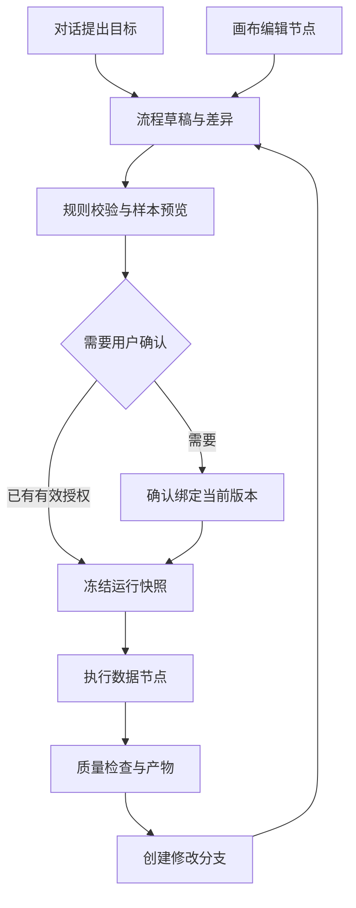
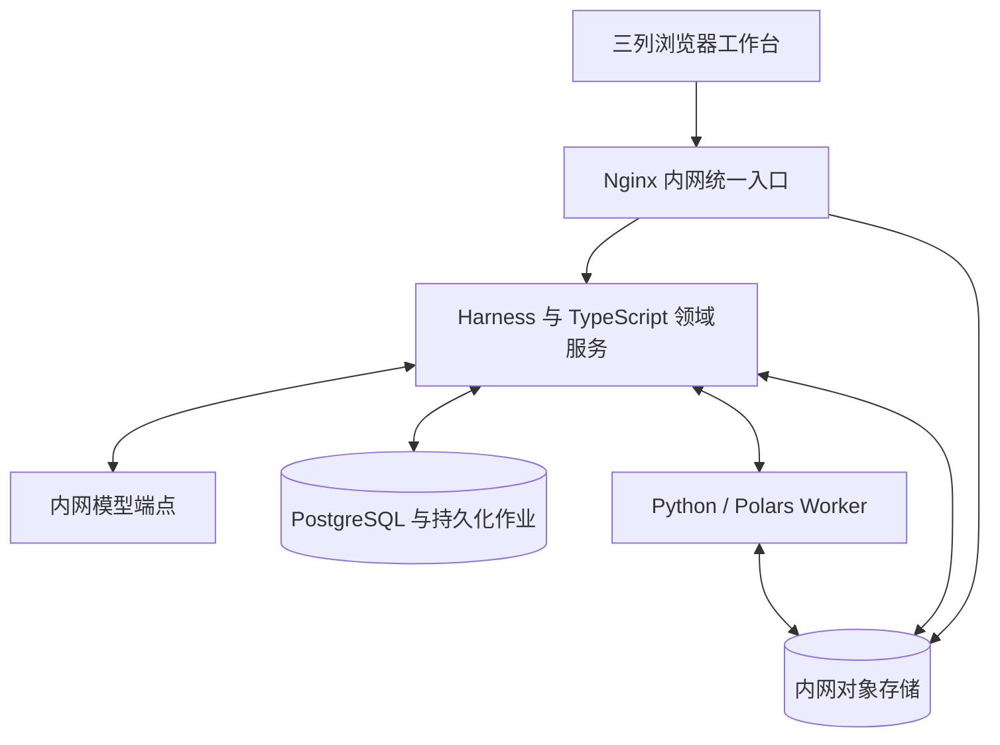

# DeepSeek Harness 数据准备 Agent：最终实施方案

版本：v1.0  
日期：2026-09-15  
适用范围：第一阶段产品、研发、测试与内网部署  
状态：方案基线；尚未完成代码实施、目标环境部署或性能实测。

本方案以用户提供的《DeepSeek_Harness_Data_Agent_Requirements(1).md》v0.4 为需求与验收基线，结合 Model X 页面所展示的三列工作台、技能调用、任务跟踪及产物归档方式，形成统一的产品与实现设计。页面截图只作为交互参考，不作为 Model X 后端技术栈或部署架构的证据。

建设目标：用户通过对话、画布与必要确认完成数据上传、数据分析、数据处理和特征工程，获得达到已配置训练契约的全量数据、字段定义、处理配方、拟合参数及质量记录。

技术组合确定为 **DeepSeek Harness + TypeScript 领域插件 + Harness React Web 扩展与 React Flow + PostgreSQL + Python/Polars Worker + 内网文件/对象存储**。部署优先适配已讨论的 Nginx 与 RustFS，不假定现有实例、SSO 或 Java 平台已经具备本方案所需条件。

| 决策 | 本版采用的边界 |
| --- | --- |
| 首版范围 | 六项要求全部为 P0；可以分增量开发，完整发布不削减验收范围 |
| 流程编排 | React Flow 可编辑 DAG 为 P0，在右列切换与扩宽编辑；节点列表不能替代画布验收 |
| Skill 自定义 | 包/内网 Git 编辑导入、Web 登记、评测、发布、停用、回滚与运行绑定全部为 P0 |
| Skill 在线编辑器 | 可视化正文编辑器为 P1；不影响首版完整自定义与维护能力 |
| 数据计算 | Polars 为主计算后端，按需使用 scikit-learn；DuckDB/Spark 为后续适配 |
| 执行可靠性 | 持久化作业、节点级恢复、有效尝试唯一发布；不承诺任意代码只执行一次 |
| 内网交付 | 本版要求支持离线安装、升级和恢复；运行默认禁公网，不假定网络物理隔离 |
| 产品终点 | `ready_for_training_contract` 数据交付；模型训练、调参和预测服务后续建设 |
| 验收 | 保留 AC-01～AC-44，补充 AC-45～AC-54；新增条款不替换原验收 |

阅读路线：产品与页面见第 1～6 节；Agent、Skill 与执行见第 7～10 节；验收与交付见第 11～12 节；领域模型、接口和工程初始化见第 13 节；部署见第 14 节；六项要求与证据映射见第 15 节。

## 1. 产品目标与已确认范围

建设一款面向数据分析人员、建模人员和开发人员的数据准备工作台。用户上传表格、描述目标后，Agent 加载版本化业务 Skill，生成可编辑的处理流程；用户可以确认关键方案、调整节点、预览效果和局部重跑，最终获得可追溯、可复用的数据准备产物。

| 编号 | 用户确认的六项要求 |
| --- | --- |
| R1 | 支持内网部署 |
| R2 | 支持 Skill 自定义，包括新增合规 Skill 和修改已有 Skill |
| R3 | 以官方 deepseek-ai/deepseek-harness 项目为基座进行改造 |
| R4 | 支持自定义流程编排，能够编辑节点、依赖和参数并调试重跑 |
| R5 | 第一阶段支持 100 万行 × 100 列的数据集，完成数据上传 → 数据分析 → 数据处理 → 特征工程，产出可用于模型训练的数据 |
| R6 | Web 主工作区采用三列：左侧会话、中间对话、右侧任务状态 |

既有约束继续适用：对话驱动、人机协作与画布编排共用流程定义；数据分析、数据处理和特征工程提供三个预置业务 Skill，并允许新增自定义 Skill。

本方案“数据处理”包含清洗、类型转换、格式规范和受限行列处理，对应预置 data-cleaning Skill；“数据清洗”是该阶段内的主要能力。产品阶段名称统一使用“数据上传、数据分析、数据处理、特征工程”。

首版的核心交付是“数据集 + 字段定义 + 处理配方 + 必要的拟合参数 + 数据质量与运行记录”。模型训练、模型效果评估和预测服务列入后续阶段。

首版要求：三个预置业务 Skill、自定义 Skill 的完整登记与使用、版本评测发布回滚、三列 Web 界面及六项对应验收均属于 P0；保留数据计算、流程、确认和血缘能力。Skill 优化首先指修改策略、规则、示例和依赖，并通过评测选择发布版本；首版不包含模型权重训练或无人审核的线上自我修改。

已确认“支持内网部署”。本方案采用“运行默认禁公网、支持离线安装和升级”的 P0 交付基线，不据此假定用户网络已经物理隔离，也不要求用户必须自行搭建模型推理集群。模型可接入企业现有内网服务。

## 2. 实施选型与环境假设

下表作为本方案的实施基线。OS、资源、模型端点和企业认证等环境参数需在部署清单中落定；这些参数不改变六项 P0 目标。

| 尚未明确的事项 | 本方案采用的假设 | 影响 |
| --- | --- | --- |
| 业务场景 | 通用结构化数据；金融字段仅用于举例 | 不内置某种风险标签或银行业务规则 |
| 输入结构 | 单张建模宽表优先 | 多表关联、交易明细按预测时点聚合列为 P1 |
| 文件格式 | P0 支持 CSV、Parquet；Excel 为 P1 | 大文件先统一成带 Schema 的列式数据 |
| 部署拓扑 | 内网单团队起步，采用 Linux 容器；具体 OS、CPU 架构和编排设施待实施适配 | 保留项目权限和执行隔离，单机与内网多机都可采用相同逻辑边界 |
| 模型服务 | 优先接入企业现有内网模型网关或内网推理服务；地址与鉴权可配置 | 验证网关上游也符合数据边界；不自动回退公网模型 |
| 计算资源 | 单机异步任务起步，资源不足时排队或拒绝任务 | 不因“百万行”直接引入分布式计算集群 |
| 既有系统 | Nginx、RustFS 作为优先适配方向；不假定具体实例与认证条件已就绪 | 复用前验证版本和接入条件；不为此额外引入 Java 服务层 |
| 标签与数据切分 | 按每个项目在产品内配置 | 涉及学习统计参数时，必须先明确拟合数据范围 |

优先级约定：P0 是完整首版发布必须具备的能力；P1 是后续扩展。P0 可以分增量开发，但发布验收包含三种已确认的交互方式。

## 3. Harness 的复用边界

截至本次核对，官方项目仍标注 developer preview，并提示可能发生兼容性破坏。因此开发启动时应固定一个验证过的提交及依赖锁文件，升级后执行适配检查。[官方仓库](https://github.com/deepseek-ai/deepseek-harness)

官方架构提供插件组合、工具注册、Agent 运行循环、会话事件以及子 Agent 等扩展点。本项目采用领域插件接入这些能力，并保留独立的数据任务状态。[官方架构](https://github.com/deepseek-ai/deepseek-harness/blob/master/docs/architecture.md)

| 能力 | 本项目采用方式 | 仍需开发或验证的部分 |
| --- | --- | --- |
| 模型调用与 Agent 循环 | 复用 Harness 对应能力 | 数据任务提示词、结构化方案校验、调用预算 |
| 工具注册与调用 | 接入领域工具 | 数据集授权、参数校验、任务提交和结果摘要 |
| 会话记录 | 关联对话与运行轨迹 | 业务流程版本、数据血缘、任务恢复不依赖聊天文本 |
| 子 Agent | 用于分析方案和独立复核 | 统一版本、权限、输出契约和调度预算 |
| Skills | 复用发现与按需加载能力 | 新增不可变发布版本、评测、节点绑定和回滚机制 |
| Web 界面 | 验证现有界面扩展方式 | 画布、数据预览、节点参数、版本比较与确认卡片 |
| Workflow | 可服务于 Agent 子任务协调 | 数据 DAG、缓存失效、产物引用事务发布、节点重跑需要领域实现 |
| 沙箱相关能力 | 复用适合的执行接缝与策略入口 | 计算任务的网络、资源、凭据和项目隔离要独立验证 |

官方 Workflow 的用途是运行模型编写的脚本并启动子 Agent；其中 phases 只是进度描述，不定义执行拓扑。聊天运行记录的持久化不能据此推定为数据 DAG 的可靠恢复能力。本方案将数据流程调度明确列为新增需求。[官方 Workflow 文档](https://deepseek-harness.github.io/deepseek-harness/en/reference/subsystems/workflow)

官方 SandboxMode 主要约束文件系统效果，网络和进程可见性不在该模式的语义范围内。因此本方案为 Python 计算任务另外规定资源和网络边界。[官方 Sandbox 文档](https://github.com/deepseek-ai/deepseek-harness/blob/master/docs/subsystems/sandbox.md)

以上是资料核对后的边界判断，尚未在目标环境验证插件接口兼容性。本方案后文的插件名、服务名和契约名均为拟议设计，不表示官方已经提供同名实现。

R3 的交付依据包括固定上游提交、可构建的改造源码、保留和扩展模块清单及启动说明。主 Agent 运行、会话和 Skill 加载通过 Harness 的适配扩展接入；新增数据流程服务与其建立真实工具和事件关联。仅在文档中出现项目名不能替代这一集成验收。

### 3.1 固定基座与适配原则

使用官方源码创建业务分支，记录上游提交 SHA、依赖锁文件及镜像摘要。核对时根 package.json 标注 `0.1.5-rc.2`、`pnpm@11.7.0`，Node 约束为 `^22.19.0 || >=24.0.0`；这只是本次读取到的源码要求，不等同于已验证的生产版本或 npm 最新版。实际基线以增量 A 的测试结果确定。[官方 package.json](https://github.com/deepseek-ai/deepseek-harness/blob/master/package.json)

业务能力通过独立 Profile、领域插件和必要的 Web 扩展组合接入。模型循环、会话与工具调用继续由 Harness 承担；数据流程、训练契约与正式产物由领域服务承担。上线运行不动态安装插件，也不让业务 Skill 修改主运行配置。

当前 Web 采用服务端业务状态、Remote 通信、客户端模型和 React 插槽分层。新增页面沿用这条状态路径，避免聊天消息、画布组件和任务面板分别维护相互冲突的业务状态。[官方 Web Client 架构](https://deepseek-harness.github.io/deepseek-harness/en/reference/subsystems/web-client)

三列工作台优先扩展现有会话、对话与右侧面板；若具体布局需要调整，在独立业务 UI 模块完成，并通过固定版本验证入口与依赖。右侧面板已有可注册标签与插槽，业务流程和产物视图需自行实现。[官方 Right Sidebar](https://deepseek-harness.github.io/deepseek-harness/en/reference/subsystems/sidebar-right)

## 4. 用户路径与统一流程

### 4.1 一次完整任务

用户可见的阶段顺序固定为“数据上传 → 数据分析 → 数据处理 → 特征工程”，下述操作展开这些阶段；正式导出及训练契约检查是这一业务流程的完成条件。

1. 用户创建项目、上传文件；系统解析文件并建立原始数据版本。
2. 用户确认字段类型和角色，例如特征、标签、实体 ID、时间、忽略字段。
3. 系统提供结构概览；需要拟合式处理时，先配置训练范围及切分规则。
4. 用户描述目标；Agent 根据允许查看的数据摘要生成处理方案与流程草稿。
5. 用户通过对话或画布修改同一份草稿；系统展示变更、数据影响和需要确认的操作。
6. 系统在固定样本上预览方案，用户确认后生成不可变的运行快照。
7. 后台执行全量流程，逐节点记录输入、输出、指标、日志与失败原因。
8. 用户可从已完成节点创建分支、改参数并重跑受影响部分。
9. 质量检查通过后导出数据、字段定义、配方、拟合参数与报告。

### 4.2 三种入口，共用一个业务定义

| 用户操作 | 系统行为 | 一致性要求 |
| --- | --- | --- |
| 对话：“收入缺失值改成中位数填充” | 生成带基础版本号的流程修改提案 | 通过与画布相同的校验和确认服务提交 |
| 画布：修改填充节点参数 | 更新流程草稿并显示差异 | Agent 后续读取更新后的版本 |
| 确认卡片：同意某次修改或运行 | 记录确认人、对象、版本、范围和时间 | 数据或参数发生相关变化后，旧确认不能沿用 |
| 点击“运行” | 冻结流程、输入版本及策略 | 执行期间编辑草稿不改变正在运行的快照 |
| 对话：“从编码节点重跑” | 定位节点并调用统一重跑接口 | 与画布重跑具有相同依赖检查和权限 |

聊天内容用于解释意图；版本化流程定义是计算执行的依据。Agent 无权直接覆盖另一个用户已经提交的新版本。



### 4.3 三列 Web 主工作区（P0）

桌面主工作区从左到右固定为“会话 → 对话 → 任务状态”。默认同时展示三列，可拖动分隔线调整宽度；初始比例建议约 20% / 50% / 30%，以实际桌面可读性验证。用户布局偏好可保存，小屏可折叠为切换视图，桌面验收须使用三列同时可见的状态。

| 左列：会话 | 中列：对话 | 右列：任务状态 |
| --- | --- | --- |
| 新建、搜索、重命名和切换会话 | 当前会话消息、用户目标与文件附件 | 当前运行选择器、流程与数据版本 |
| 显示所属项目、最近消息与运行状态摘要 | Agent 方案、执行卡片、必要确认与错误说明 | 数据上传、数据分析、数据处理、特征工程阶段状态 |
| 提供流程模板与 Skill 管理入口 | 输入框、文件上传、Skill 选择及版本信息 | 当前节点、排队/运行/待确认状态、可核对进度和耗时 |
| 切换会话后定位对应工作上下文 | 点击运行或产物卡片定位对应任务 | 失败原因、取消、重跑、数据与报告入口 |

流程编辑位于右列“任务状态 / 流程编排”切换视图；编辑时可扩大右列，同时保留左列会话和中列对话。右列内部显示画布或节点参数，不增加常驻第四列。右列顶部保留当前任务/草稿身份和运行状态摘要；返回状态视图后恢复选择。Skill 管理入口可打开独立管理视图或弹层，关闭后恢复原会话、运行和布局。

主工作区的状态规则：

1. 一个 Session 可以关联多个 Run。右列明确当前 run_id、创建时间及流程版本，允许切换查看历史运行。
2. 对话中的运行卡片、产物卡片关联所属 Run；运行前的提案和确认绑定 proposal_id、流程版本与数据版本，运行创建后保留对原提案/确认的引用。执行中的确认同时绑定 run_id。
3. 切换会话会同步切换中列及右列，后台任务继续执行。事件按 session_id/run_id 路由，迟到的旧会话事件不能污染当前页面。用户正在查看历史运行时，新运行事件不自动抢占其选择。
4. 右列以服务端持久化状态为准。刷新或重连先读取带事件游标的运行快照，再补放后续事件；客户端去重并有序应用，连接中断只显示“状态待同步”。
5. Agent 活动显示“生成方案、等待工具结果”等状态。计算进度由 Worker 上报阶段和处理量，仅在总量可靠时显示百分比，不用流式 Token 数推算计算进度；没有可靠权重时不展示虚构的全流程百分比。
6. 中列确认卡与右列待确认节点保持一致。重复点击和事件重放不得重复推进任务；服务端校验权限、版本及幂等标识。
7. 用户提交取消后，由后端确认请求受理并显示“取消中”；执行确实停止后显示“已取消”。停止消息流不代表取消后台计算。修改后重跑产生新的运行记录，并关联来源运行。
8. “计算成功”“产物已发布”和“可用于模型训练”分别有事实依据。产物检查尚未通过时展示具体原因，不能仅根据 Agent 回复显示成功。

桌面界面验收覆盖三列同时显示、长会话与长任务列表滚动、列宽调整、流程编辑、会话/历史运行切换、页面刷新和网络重连。页面引用的所有字体、图标及编辑器资源遵守内网交付要求。

### 4.4 参考页面的功能映射

| 参考页面元素 | 本版产品实现 | 范围 |
| --- | --- | --- |
| 新建任务与历史会话 | 项目内创建 Session、关联数据版本、按日期分组、搜索与重命名 | P0 |
| 数据中心与输入框文件标签 | 数据集管理、分片上传、解析状态、Schema/角色配置；输入框显示当前版本与用途 | P0 |
| 技能中心 | 预置/自定义 Skill 列表、版本差异、评测、发布、选择、停用与回滚 | P0 |
| 场景实验室 | 首版提供流程模板管理入口，可从模板进入右列画布；行业场景市场后续增加 | 模板 P0，场景市场 P1 |
| 思考过程与技能调用 | 展示执行说明、方法依据、Skill 名称/版本、调用状态和可核对的工具记录 | P0 |
| Shell 调用记录 | 展示受控算子/维护者脚本的执行记录；默认折叠技术日志 | P0；任意 Shell 和任意代码节点不纳入 |
| 待办与第几轮 | 展示计划修订和历史 Run；真实计算状态单独来自 NodeRun/Attempt | P0 |
| 产物与归档到工作空间 | 本次正式产物、历史版本、预览、下载和归档 | P0 |
| Notebook | 首版支持处理配方与已执行脚本预览/下载；完整交互式 Notebook 后续增加 | 完整 Notebook P1 |
| XGBoost、调参与精确率/召回率目标 | 首版终点改为训练契约检查和数据导出；不设置模型效果达标循环 | 后续阶段 |

数据中心、Skill 管理和模板目录可采用独立管理视图或弹层；返回时恢复会话、选中 Run、画布草稿和布局。真正的流程编辑仍在三列主区的右列“流程编排”完成，不以独立管理页替代该验收。

### 4.5 对话卡片与任务面板

| 卡片 | 必须呈现 | 主要操作 |
| --- | --- | --- |
| 数据概览 | 数据版本、行列数、Schema、字段角色、导入问题、统计范围 | 预览、修正角色、打开数据中心 |
| 分析结果 | 问题字段、指标、全量/近似/样本标记、证据、建议与未证实假设 | 查看报告、定位字段、生成处理提案 |
| 处理方案 | 基础流程版本、输入版本、节点变更、参数、样本影响及确认范围 | 改参、画布定位、预览、确认或拒绝 |
| 处理结果 | 输入/输出版本、行列与缺失变化、剔除记录、质量门、未解决问题 | 查看差异、下载、从来源版本创建分支 |
| 特征结果 | 特征公式、依赖、类型、维度、Transformer、fit 范围 | 检查特征、调整配方、导出 |
| 运行与错误 | Run/节点身份、受理/排队/运行状态、失败类别、允许的下一步 | 定位右栏、取消、重试或创建修改运行 |

输入框绑定 DatasetRef 和用途，显示版本和解析就绪状态；未导入完成的文件不能作为正式运行输入。对话附件、分析报告和模型描述不改变数据版本本身。页面只向有权限的用户提供相应操作。

右列默认显示当前 Run、四阶段摘要、节点列表和产物。计划待办完成数表示计划条目，不作为作业百分比；未产生可靠总量时显示排队、当前阶段与耗时。“历史轮次”对应计划/运行修订，不能把不同版本的待办简单相加成当前总进度。

## 5. 功能需求

### 5.1 项目、数据集与输入解析

| 编号 | P0 需求 | 验收要点 |
| --- | --- | --- |
| DATA-01 | 创建项目、上传 CSV/Parquet、显示导入进度和失败原因 | 上传失败不生成可使用的数据版本；支持重试 |
| DATA-02 | CSV 支持编码、分隔符、表头、空值标识等配置；保留解析参数 | 同一文件配合不同解析参数产生不同版本 |
| DATA-03 | 原始文件不可覆盖，导入得到不可变版本、内容校验值和 Schema | 所有下游产物能定位到源文件版本 |
| DATA-04 | 显示类型推断、置信提示和解析失败数量，允许用户纠正 | 低频混合类型不得被静默转空值 |
| DATA-05 | 确认一行代表的业务对象；字段角色支持 feature、target、entity_id、record_id、event_time、prediction_time、ignore | ID、标签和被禁用字段默认不进入 feature_columns |
| DATA-06 | 固定样本、分页预览、列搜索和字段统计 | 浏览器不加载完整百万行数据 |

类型处理须覆盖前导零 ID、超出安全整数范围的编号、金额精度、时区、空字符串与真正缺失值、重复列名、NaN/Inf。不能为了转成数值而改变业务含义。金额等精度敏感字段需要显式的精度与舍入策略。

坏行默认阻止导入完成；用户可以选择隔离坏行并保留行号、原因和隔离产物。跳过坏行属于改变样本范围，需要记录确认与数量。

导入时生成稳定的内部 row_id，并关联源数据版本和原始记录位置。切分映射、标签对齐、隔离/剔除记录和导出血缘均通过该标识关联；过滤、去重或重排后，不使用 DataFrame 当前行号重新对齐标签。row_id 默认属于元数据列，不自动进入特征矩阵。

### 5.2 数据分析与诊断

P0 提供行列数、Schema、缺失数量与比例、唯一值信息、数值分布、分位数、类别 Top-K、常量列、重复记录检查、日期范围和类型异常。

统计结果必须标记统计范围：全量精确、全量近似或样本估计。行数、用于导出的缺失/坏行检查、关键唯一性约束采用全量校验。近似基数或样本相关性只用于诊断；如果要根据阈值删除字段，先在允许的拟合范围内完成规定精度的复核。

P0 可以提供所选数值列的相关性分析，不默认对所有列生成无上限的两两计算。诊断结果包括问题、证据指标、建议、影响范围和适用条件；Agent 不得编造缺失率、异常数量或模型收益。

已划分验证/测试集时，影响特征选择与转换参数的分析以训练数据为依据。测试集的质量报告不能反向进入 Agent 的自动调参循环。

### 5.3 清洗算子

| 算子 | P0 支持 | 必须明确的规则 |
| --- | --- | --- |
| 缺失处理 | 常量填充、训练范围的均值/中位数/众数填充、保留缺失 | 全空列策略、缺失指示列、适用字段；不填充目标标签 |
| 类型处理 | 安全转换、日期解析、字符串格式规范 | 溢出、精度、时区和转换失败策略 |
| 去重 | 指定键或整行重复检测，按明确规则保留 | 不能把合法的重复交易直接认定为脏数据；保留规则和排序必须确定 |
| 异常处理 | 业务固定范围、基于训练数据的截尾、异常标记 | 默认先标记；删除、截断和业务边界需确认 |
| 行列筛选 | 保留/移除指定列、按受限表达式过滤行 | 显示数量及标签/群体分布变化，记录删除原因 |
| 类别规范 | 受控字典映射、空白处理、明确的同义值合并 | 未匹配值保留或转为约定未知值，不猜测业务等价关系 |

改变样本定义的筛选和去重应作为明确的数据整理步骤，通常在切分前按已确认的业务规则执行。基于训练统计得出的异常阈值只在训练范围拟合，并以相同规则应用其他分区；不得为提高报告表现删除验证/测试样本。

### 5.4 特征工程

| 类别 | P0 内容 | 约束 |
| --- | --- | --- |
| 数值变换 | 标准化、Min-Max、log1p、简单四则与比例 | 标准化参数仅来自训练范围；定义负值、除零和无穷大策略 |
| 类别处理 | 保留原生类别、受限 One-Hot、明确顺序的序数映射 | 不对无序类别暗示大小关系；类别词表需固定，处理未知类别 |
| 日期衍生 | 年月日、星期、已知参考时点的时间差 | 禁止把运行当天作为未记录的隐式参考时间 |
| 缺失特征 | 指定字段缺失指示 | 保存与源字段的血缘 |
| 字段选择 | 人工选择、常量列和缺失率阈值建议 | 数据驱动的选择基于训练范围；自动删除需要有效确认 |
| 特征定义 | 中文解释、公式、依赖列、数据类型和空值策略 | 每个输出特征可追溯、可重新计算 |

One-Hot 必须预估新增列数和内存，超过配置上限时阻止执行并要求调整。P0 不默认将高基数 ID 编码成数万列，也不要求所有下游模型采用同一种编码方式。

P1：标签驱动筛选、IV/WOE、目标编码、自动交叉特征、PCA、实体聚合与时间窗口特征。它们需要额外的验证策略，不作为首版的隐含能力。

### 5.5 画布与节点调试

P0 节点类别包括数据源、结构诊断、字段角色、业务整理、数据切分、清洗、特征转换、质量检查、导出。确认是系统强制检查点，可以在画布显示；用户删除一个可见确认节点不能绕过后端确认策略。

每个节点展示参数、输入/输出 Schema、输入/输出版本、运行状态、样本差异、资源与耗时、错误原因、运行记录。操作支持新增、删除、连接、复制、修改参数、样本试跑、运行至此、从此重跑及查看历史。

P0 使用有向无环图，支持切分结果和多个产物出口，检查环路、悬空输入、端口类型、必填字段及跨版本引用。用户可以从空白流程、已保存模板或 Agent 提案开始编排，保存为新的流程版本和可复用模板；流程定义支持按本项目 Schema 导入、导出。新增自定义 Skill 发布并满足输入输出契约后，可以作为 Skill 阶段节点加入流程，展开或查看其生成的算子子流程。任意循环、任意代码节点和实时多人协同编辑为 P1。

节点端口需要区分 DatasetRef、TransformerRef、ReportRef。相同字段的多分区转换须引用同一个已拟合 TransformerRef，不能各自在验证集重新学习参数。

### 5.6 结果导出

| 产物 | 内容 |
| --- | --- |
| 数据文件 | Parquet 为首选；CSV 可选；按照切分结果分别导出 |
| 字段字典 | 列名、类型、角色、含义、公式、依赖、允许空值和编码规则 |
| 流程与配方 | 流程版本、节点参数、拟合顺序、应用顺序、依赖版本 |
| 拟合参数 | 填充值、缩放参数、类别词表等；标记 fit 数据版本 |
| 数据质量报告 | 处理前后变化、已解决与残留问题、剔除行数及原因 |
| 运行清单 | 输入和输出校验值、运行 ID、算子版本、随机种子、执行环境 |

导出 CSV 时同时交付 Schema、编码和空值约定，避免重新导入时丢失类型。用于电子表格查看的转义导出应与供程序读取的原值导出区分，任何值改写都写入清单。

### 5.7 大文件上传与数据中心

上传由业务服务控制生命周期，数据分片通过内网入口传输到对象存储。P0 包含初始化上传、获取分片上传授权、分片重试、查询已上传分片、续传、完成与终止；服务端记录 upload_id、文件身份、所属项目、分片编号与 ETag。分片大小、并发和重试预算可配置，默认采用有上限的并发，具体数值通过网关与存储联调冻结。

上传完成后还需校验对象、解析和建立 Schema。状态依次区分 uploading、uploaded、importing、ready，以及 failed/aborted；“文件已上传”不等于“数据集可用”。对象存储的 multipart ETag 不被当作整个文件的通用内容摘要；导入阶段计算约定的内容校验值，并保留文件字节与解析后的逻辑数据身份。

重传或同名文件不能覆盖已经发布的原始版本。上传完成、导入创建和失败重试使用幂等标识；失败保留可诊断信息，过期未完成的 multipart 与临时数据按保留策略回收。用户主动终止上传不得删除其他运行引用的数据。

数据中心支持项目内列表、搜索、版本关系、字段与样本预览、处理记录及运行定位。相同原文件采用不同解析配置时形成不同导入版本。浏览器上传进度、服务端解析进度与后续计算进度分开显示。

### 5.8 产物预览、归档与保留

正式产物包括数据文件、字段字典、流程配方、拟合状态、质量报告和运行清单；可附已执行的维护者脚本或执行计划。脚本展示不赋予用户任意执行权限。每个产物记录项目、Run、节点、尝试、输入版本、内容摘要、格式、大小和可用状态。

产物先写入临时/候选位置，业务发布后才在右列成为可交付文件。归档到工作空间是保存业务引用与保留关系，不要求复制大文件，也不改变内容版本。删除会话不自动删除正式数据；清理前检查血缘、缓存、历史运行和归档引用，配置保留时间与软删除策略。

HTML 报告预览使用隔离的展示容器与限制策略，禁止继承主应用凭据或任意访问应用接口；外部字体、脚本与图片不能成为内网预览依赖。数据文件采用分页/列选择预览，Markdown、JSON 和脚本提供受控文本预览。下载接口校验项目权限，支持大文件流式下载和适用的 Range 请求。

## 6. “可用于建模”的质量定义

### 6.1 首版也要具备 fit / transform 语义

填充统计、类别词表、缩放参数以及数据驱动的特征选择会从数据中学习。应先明确训练范围，仅在该范围拟合，再把同一转换用于验证集、测试集和未来数据。scikit-learn 官方将预处理与特征选择的泄漏列为常见问题，并建议通过 Pipeline 等机制保持这一边界。[官方 Common pitfalls](https://scikit-learn.org/stable/common_pitfalls.html)

本项目提出以下执行规则：

1. 无状态算子声明固定公式或业务映射，不读取其他分区统计量。
2. 有状态算子声明 requires_fit=true，并强制指定 fit_scope。
3. 用户已有数据分区时导入分区映射；否则提供随机/分层、实体分组或按时间切分配置。
4. 切分方式由任务语义决定；系统不得对重复实体或未来预测任务无条件采用随机切分。
5. 验证/测试分区仅执行 transform；未知类别、全空列和缺失字段遵循已固定的处理策略。
6. 后续进行交叉验证时，需使用未拟合配方在每个训练折重新拟合，不能直接复用整个训练集拟合的参数。

样本预览产生的 TransformerRef 必须标记为 preview。正式运行在完整训练分区重新拟合正式转换器，再应用到其他分区；预览参数与预览数据不得直接发布为正式产物。界面应区分“已确认配方”和“已完成全量拟合”。

### 6.2 产物状态

| 状态 | 适用条件 | 对用户的说明 |
| --- | --- | --- |
| prepared | 完成结构清洗和无状态特征；拟合范围或目标语义尚未明确 | 可继续数据准备；尚不能保证符合后续训练与评估约定 |
| ready_for_training_contract | 字段角色、训练范围、转换参数及质量检查符合已配置契约 | 可按该契约进入建模；交叉验证仍须折内拟合 |
| blocked | 存在未处理的类型错误、非法依赖、失败质量门或缺失必要确认 | 展示原因与受影响节点，不能标记为正式可用产物 |

没有目标标签也可以准备无监督学习或推理数据，但必须明确其用途与拟合范围。标签存在时不得填充标签；缺失标签的记录按用途隔离或保留为未标注数据，并记录选择过程。

系统可以识别疑似标签衍生字段、未来字段和不合理的 ID 特征，但不能宣称自动证明不存在业务泄漏。字段产生时间、预测时点和标签定义需要建模负责人确认。

R5 的正式闭环验收必须到达 ready_for_training_contract，交付实际全量处理结果、字段字典、处理配方、必要的拟合参数和质量报告。prepared 是合法的中间结果，但不能作为“已交付可训练数据”的通过依据。测试场景应预先提供可满足的字段角色、拟合范围和数据质量契约；首版不要求执行训练算法。

### 6.3 内部执行顺序与训练契约

四个用户阶段保持不变，内部算子图按以下语义执行。早期页面可先配置切分意图，实际分区映射在已确认的样本整理后物化。

| 内部步骤 | 执行规则 | 关键产物 |
| --- | --- | --- |
| 导入与结构诊断 | 保留源版本和稳定 row_id，全量校验类型与坏行；诊断不能自动修改样本 | DatasetRef、Schema、质量事实 |
| 业务整理 | 按已确认的固定业务规则做无状态规范、合法重复处理和样本范围整理 | 整理后 DatasetRef、保留/剔除 row_id 对账 |
| 分区物化 | 按已配置的随机/分层、实体或时间规则生成稳定分区；已有映射需校验对齐 | SplitMapRef、train/validation/test 等 DatasetRef |
| 清洗拟合与应用 | 在 train 上拟合清洗参数，对各分区使用同一转换器 | CleaningTransformerRef、清洗后分区 |
| 特征拟合与应用 | 在前序转换后的 train 上拟合下一个有状态算子，依次应用于各分区 | TransformerRef、FeatureSetRef |
| 正式校验与导出 | 校验全部正式分区、Schema、标签对齐、维度、参数来源和确认范围 | 训练契约清单、正式数据与报告 |

无状态操作可以按依赖在适合的位置执行；任何读取统计量来选择阈值、字段或参数的操作，都必须声明训练范围，不能借“分析”或“清洗”阶段名称绕过 fit 限制。全量结构质量事实可用于查错，验证/测试集的表现不能反馈进自动优化策略。

DatasetRef、TransformerRef、ReportRef 为主要端口类型。FeatureSetRef 是带特征字典的 DatasetRef 子类型；AnalysisReportRef、CleaningReportRef 是 ReportRef 子类型；SplitMapRef 是带 row_id 与分区标签的受控映射产物。多分区通过具名端口组合，校验器显式检查这些兼容关系。

训练契约至少包含用途（监督/无监督/推理数据准备）、字段角色、分区定义、fit_scope、feature_columns、target（适用时）、Schema/空值约定、未知类别策略、转换器及其 fit 输入、质量门和数值容差。合同状态与文件是否发布分别保存；用途未明确时不得用默认监督学习口径补齐标签定义。

## 7. Agent 分工、工具与记忆

### 7.1 分工

| 角色 | 职责 | 产出 |
| --- | --- | --- |
| 主 Agent | 理解目标、组织工具调用、生成或修改流程、解释进展 | PlanProposal、流程变更与执行摘要 |
| 分析/特征专家角色 | 基于允许查看的摘要提出有依据的处理方案 | 问题列表、算子建议、适用条件与证据引用 |
| 复核角色 | 检查标签、时间、ID、参数范围和前后结果是否符合契约 | 结构化复核意见 |
| 确定性校验器 | 校验类型、资源、权限、数据边界、版本及质量门 | 允许、拒绝或等待确认 |

P0 可以采用一个主 Agent 按需调用专家子 Agent。普通类型转换、缺失计数和表达式计算由算子执行，不必各自启动一次模型调用。多 Agent 的一致意见也不能替代程序校验或用户确认。

### 7.2 工具契约

拟议领域工具包括 inspect_dataset、profile_dataset、propose_workflow_patch、validate_workflow、preview_node、submit_run、get_run、cancel_run、get_artifact_summary。它们属于本项目设计命名。

工具参数使用项目和版本化产物引用，不接受模型自由指定服务器任意路径。submit_run 返回 RunRef；独立导入、统计和预览提交返回 JobRef。Run 中每个计算节点再关联调度 Job，避免混用 run_id 与 job_id；状态和结果通过查询或事件流获得。工具返回有界的结构化摘要和产物引用，不返回整张数据表。

PlanProposal 至少包含目标、输入版本、基础流程版本、建议算子与参数、证据指标、预期影响、需确认的事项和未满足前提。LLM 输出经过 Schema 和业务规则校验后才能成为草稿。

### 7.3 三个业务 Skill 的职责与接口

P0 将 data-analysis、data-cleaning、feature-engineering 作为三个可独立维护和评测的预置业务 Skill，注册与调用机制允许新增符合契约的自定义 Skill，不将可用名称固定为三个。同一主 Agent 可以依次使用它们，必要时委派子 Agent；Skill 的数量不决定 Agent 的数量。

Skill 描述适用场景、诊断与选择策略、业务约束、参考资料、工具使用步骤和输出要求。Tool 提供调用接口，算子实现确定性的计算，Workflow 负责顺序、版本、确认和恢复，Agent 根据当前任务使用这些能力。

| Skill | 输入 | 决策与工作步骤 | 输出 |
| --- | --- | --- | --- |
| data-analysis | DatasetRef、字段角色、分析目标、允许分析的分区和数据策略 | 获取结构与统计；识别问题；核对证据；解释影响与处理建议 | AnalysisReportRef、结构化问题与证据、后续处理建议 |
| data-cleaning | DatasetRef、AnalysisReportRef、业务约束、拟合范围、当前流程版本 | 对问题选择处理策略；生成 CleaningPlan；预览影响；按确认结果提交受控执行 | 清洗计划；执行后 DatasetRef、转换器引用及 CleaningReportRef |
| feature-engineering | DatasetRef、字段角色、业务目标、预测时点（适用时）、拟合范围 | 选择可解释特征；生成 FeaturePlan；校验泄漏和维度预算；拟合/应用并检查 | 特征计划；执行后 FeatureSetRef、字段字典及 TransformerRef |

上述 Ref 和 Plan 类型是本项目拟议契约，不是 Harness 原生返回类型。工具产出的数据统计和版本引用应进入结构化结果，文本报告由这些事实生成。

每个 Skill 的运行结果都应显式标记 status：proposed、needs_review、submitted、executed 或 failed。异步任务受理后返回 submitted 及 RunRef/job_id，具体执行进度从对应 Run/NodeRun 或独立 Job 查询；只有实际产物完整提交后才能返回 executed。生成方案、等待确认、提交任务、完成计算属于不同结果状态；仅提出建议时不得填写虚构产物地址或显示“执行完成”。数据分析的只读统计可以在允许范围内直接运行，清洗与特征变更遵循第 8 节确认规则。

#### data-analysis 的最低行为要求

- 根据字段逻辑类型选择统计方法，区分全量、样本和近似结果。
- 每个问题关联指标、统计范围、规则来源和字段，不仅给出自然语言判断。
- 可以建议保留缺失、保留异常或不做转换；不把所有异常都解释为脏数据。
- 不直接修改输入数据；后续变更通过清洗或特征流程提交。

#### data-cleaning 的最低行为要求

- 将问题映射为受支持算子、参数和影响范围，缺乏业务依据时提出待确认项。
- 例如发现收入缺失，先区分未知、未适用与采集失败等可能含义；在任务允许时建议中位数填充及缺失指示，保留相应依据。
- 对标签、ID、金额精度、坏行、合法重复和训练范围执行规定检查。
- 提交执行前展示字段与行数影响；执行后对账变化数量和未解决问题。

#### feature-engineering 的最低行为要求

- 优先生成有公式、含义和数据来源的特征，保留每个特征的决策理由。
- 根据下游数据契约选择保留类别、编码或缩放；不自动对所有列采用同一变换。
- 缺少预测时点等业务前提时，不生成依赖该前提的时序特征。
- 正确区分 fit 和 transform，检查未知类别、除零、维度膨胀和疑似泄漏。
- 首版报告计算正确性和业务适用性，不声称未经建模验证的预测效果提升。

### 7.4 Skill 文件组织与平台元数据

官方 Skills 支持发现、作用域注册和按需加载；目录可以采用 `.dsh/skills/<name>/SKILL.md`。模型先看到名称和描述，再加载相关正文和显式引用的资源。具体搜索路径和优先级应以固定提交核对。[官方 Skills 子系统](https://deepseek-harness.github.io/deepseek-harness/en/reference/subsystems/skills)

三个 Skill 采用独立的直接子目录：data-analysis、data-cleaning、feature-engineering。阶段内的填充、计数和编码复用共享算子；不需要为每个算子再建立一个独立 Skill。

| 相对路径 | 用途 | 谁消费 |
| --- | --- | --- |
| SKILL.md | name、description、适用条件、关键步骤、约束和引用入口 | Harness 加载后由 Agent 使用 |
| references/ | 特定业务规则、处理决策说明和必要示例 | Agent 按场景加载；不默认全量注入 |
| scripts/（可选） | 必须随 Skill 提供且经过验证的辅助脚本 | 受控工具/执行服务，不因加载 Skill 自动运行 |
| contracts/input.schema.json | 输入引用、目标、范围与前提的约束 | 本项目 Skill 适配层 |
| contracts/output.schema.json | 方案、证据、状态和产物引用结构 | 本项目结果校验器 |
| skill.manifest.json | 版本、依赖、契约路径、所需工具等声明 | 本项目版本与执行服务 |
| evals/ | 脱敏或合成测试输入、期望性质、边界场景 | 离线评测服务；不默认暴露隐藏评测答案给 Agent |

contracts、manifest 和 evals 是本项目新增约定。Harness 不会因为这些文件存在就自动实施契约验证、评测或权限校验；需编写适配模块。所需工具声明只能参与权限收窄，不能授予平台或用户未允许的权限。

skill.manifest.json 的概念示例（字段由本项目解释）：

```json
{
  "id": "data-cleaning",
  "version": "0.1.0",
  "input_schema": "contracts/input.schema.json",
  "output_schema": "contracts/output.schema.json",
  "required_tools": [
    "inspect_dataset",
    "propose_workflow_patch",
    "preview_node",
    "submit_run"
  ],
  "evaluation_suite": "data-cleaning-core-v1"
}
```

发布系统生成内容摘要和依赖锁定清单；只接受已经验证的工具/算子依赖。P0 的数据计算优先使用共享算子；脚本变更需经过相应代码检查、行为验证和受控打包，不能仅修改正文就获得任意代码执行权。首版可用脚本由维护者提供并随受控版本发布，业务用户任意编写的代码节点仍为 P1。

### 7.5 发布快照、加载和版本锁定

官方 Skill 工具的职责是加载指令；数据计算继续由工具执行。官方加载机制会重新读取完整正文，因此可编辑目录不能直接充当历史任务的固定版本来源。[官方 Skill 工具实现](https://github.com/deepseek-ai/deepseek-harness/blob/master/packages/skill/tool-skill/src/index.ts)

本项目建立 SkillDefinition、SkillVersion、SkillInvocation、SkillEvaluation、SkillRelease 五类业务对象。SkillDefinition 表示稳定名称，SkillVersion 是不可变内容快照，SkillInvocation 关联一次实际使用，SkillEvaluation 保存评测，SkillRelease 记录项目默认版本和发布事实。

版本快照覆盖 SKILL.md、所有实际依赖的 references/scripts/contracts、依赖清单及其摘要。参与运行的参考资料须随包提供或通过受控内网资源服务提供；来源于公网的材料先经过受控导入并保存固定版本，不能在执行时动态访问公网。正式运行不得悄悄回退读取同名的工作区最新文件。

WorkflowVersion 绑定 SkillRef，Run 固定实际解析的版本与摘要，SkillInvocation 记录加载和使用情况。运行还需记录 Harness 提交、模型标识与可用快照、调用参数、工具/算子版本、环境和业务规则版本。

SkillRef 的 version 由业务服务解析到不可变目录或自定义 Provider；不假定官方 `skill({name})` 支持 `name@version`。同名本地 Skill、目录热更新和 Provider 优先级不能绕过已经绑定的版本。

建议由版本服务生成运行专用 skill-lock.json，锁定相关技能和依赖，并使该运行的模型可见目录与加载内容都来自同一快照。已有会话切换 Skill 版本时，建立明确的新规划调用，避免将新旧正文混用。内网模型网关无法固定具体后端版本时，在评测与运行清单记录这一限制。

### 7.6 Skill 与画布节点的关系

画布提供“数据分析”“数据处理”“特征工程”三个预置 Skill 阶段入口，并允许加入合规自定义 Skill。每个入口显示 Skill 名称、版本、状态和最近评测信息。需要详细调试时，可展开该 Skill 生成的算子子流程。

执行顺序为：选定 Skill 版本 → 加载当前数据与业务上下文 → 生成结构化方案 → 规则校验与预览 → 按范围确认 → 冻结算子子流程 → 执行 → 回写产物和报告。确认发生在生成的具体方案上，不是对 Skill 名称授予无限执行权限。

| 操作 | 语义 |
| --- | --- |
| 按原方案重跑 | 使用冻结 DAG、参数和算子依赖；数据计算阶段无需重新让 Skill 规划 |
| 用原版 Skill 重新规划 | 创建新的规划调用，仍需校验与确认；LLM 输出不保证逐字相同 |
| 升级 Skill 后重新规划 | 创建新流程版本，展示新增/删除/改参差异，重算确认和依赖 |
| 手工调整子节点 | 记录项目流程中的人工覆盖，不直接修改发布 Skill |
| 发布新版 Skill | 新任务可选择新版，旧流程和运行继续使用已绑定版本 |
| 回滚默认 Skill | 改变后续新规划任务的默认版本，不改写历史数据 |

仅修改 Skill 文本不必使已经冻结、语义未变的确定性算子结果全部失效。规划结果缓存必须包含 Skill 和上下文版本；计算结果缓存按实际输入、算子语义、参数和依赖判断。如果自定义脚本或 Skill 资源直接参与计算，则其内容摘要也是计算缓存依赖。

### 7.7 可迭代优化的评测机制

优化过程以可复核的任务表现为依据。三套 Skill 分别维护评测集，另有完整组合流程回归集。小型精确样例验证正确性，百万行样例验证容量与性能；评测数据与业务模型训练/验证/测试分区属于不同概念，均需保留各自版本。

| Skill | 主要质量指标 | 不宜单独作为优劣依据的指标 |
| --- | --- | --- |
| data-analysis | 已知问题召回、误报、统计正确性、结论证据一致性、口径标记 | 报告长度、发现问题总数 |
| data-cleaning | 合法数据误改率、规则执行正确性、异常识别、行列对账、标签对齐 | 缺失率是否归零、删除记录数量 |
| feature-engineering | 公式与血缘正确性、拟合边界、变换一致性、类别处理、输出规模 | 生成特征数量、未经训练验证的收益描述 |

每次比较固定数据快照、切分、业务要求、工具和模型配置、权限策略及预算，仅改变待评估内容。若同时升级模型或算子，将其作为另外的对照实验，不把全部差异归因于 Skill 文本。

评测分两条路径：

1. 重新规划评测：基线与候选 Skill 从相同任务开始，比较问题识别、方案、确认请求和执行后的数据质量。开放式规划采用多次运行，报告失败比例与波动。
2. 固定流程回归：冻结历史 DAG 和参数，验证算子兼容、数据复现、人工覆盖和任务恢复。它可以发现执行回归，但不能单独证明新的规划策略变好。

发布必须通过确定性检查与有人工标注依据的业务样例。标签错位、修改禁止字段、违反拟合范围、绕过确认、产物版本不一致均为阻断项；成本或速度改善不能抵消这些错误。LLM 评审可辅助评价可读性和合理性，不能单独决定发布。

保留开发样例、回归样例和受控留出样例；留出集期望答案不作为 Skill 参考资料提供。对已反复用于调优的样例标记为开发/回归集，避免将记住测试答案当作泛化改善。

示例迭代：data-cleaning 旧版对收入缺失统一补 0。候选版根据字段语义与业务约束，在训练范围内建议中位数填充及缺失指示，并保留不适用场景。对比应验证合法 0 值未被误改、标签不受影响、测试集极端值不改变填充值，以及用户是否仍需合理确认；不能仅比较填充后的缺失率。

### 7.8 编辑、评测、发布、反馈和回滚

生命周期为 draft → candidate → released → retired。草稿可编辑；候选内容有固定摘要，修改后形成新候选；发布版本不可原地修改。新候选保留父版本、修改原因、负责人、依赖变化及评测结果。

P0 支持从内网 Git 工作目录或上传的受控包登记草稿，通过校验和离线评测后，由具有发布权限的维护者发布，并选择项目默认版本。编辑入口可先使用 Git 和 Markdown 编辑器；首版页面提供版本列表、差异、评测报告、选择版本、发布与回滚操作。该流程、评测模型和测试数据均在内网运行，不依赖公网代码托管或评测平台。

每次发布报告列出评测集版本、各类通过与失败数、核心质量指标、性能与成本变化、适用范围和已知限制。候选版只用于评测或隔离试验；真实业务的小范围采用必须选择已经通过校验、评测和维护者发布的版本，观察后再调整项目默认版本。发布资格与默认版本切换分别管理；首次发布不能用没有依据的百分比提升代替测试结果。

线上反馈收集用户拒绝原因、人工改参、失败日志、重跑原因和质量检查结果，关联到 Skill、数据和流程版本。经脱敏和维护者筛选后，将案例加入开发或回归集，再修改候选版；单次用户接受或拒绝不自动变成全局业务规则。

回滚保留原包及依赖，切换新任务默认版本；正在运行的任务维持快照。严重缺陷可停用某版本的新调用，定位受影响运行并提示产物复核。已停用版本不能静默被替换为另一版本继续执行。

### 7.9 上下文与首版范围

短期上下文包含当前目标、字段角色、流程版本、确认结果和节点摘要；每次执行前重新读取当前事实。项目长期上下文保存已确认的数据字典、业务规则与流程模板。Skills 存放处理方法和策略，数据集状态及项目个别决定保存在业务对象中。

P0 必须交付三个预置 Skill 的首版定义，以及新增自定义 Skill 所用的输入输出契约、版本快照、固定评测集、发布回滚和运行绑定。开发者维护和包导入的完整使用链路属于首版。在线可视化 Skill 内容编辑器、开放插件市场、自动候选优化流水线、搜索型向量记忆列为 P1。

### 7.10 自定义 Skill 的 P0 范围

首版支持通过内网 Git 或受控文件包创建、复制和修改 Skill，在 Web 管理入口登记、查看校验结果、启动评测、发布和选择版本。预置 Skill 可以作为模板复制为新的 Skill；发布版的任何修改均产生新的版本，不覆盖原始内容。

| 自定义项 | P0 范围 |
| --- | --- |
| 身份与发现 | 自定义唯一 ID、名称、描述和适用条件；在所属项目范围内发现和选择 |
| 指令与参考 | 编辑 SKILL.md、业务规则、示例及引用资料，并随包固定版本 |
| 输入输出 | 使用受支持的 Schema 定义输入、前置条件、状态及输出引用 |
| 工具组合 | 选择平台已注册且该项目允许的工具/算子，声明所需依赖 |
| 使用方式 | 对话显式选择或由 Agent 按适用条件选择；绑定为流程中的 Skill 阶段节点 |
| 迭代管理 | 试运行、评测、发布、停用、版本选择、回滚和包导出 |

同一项目内 ID 冲突必须显式处理，不允许上传包悄悄覆盖同名发布 Skill。项目使用范围、编辑权限与发布权限分别校验。导入时校验名称、Schema、依赖、资源路径和内容摘要，试运行只在该项目允许的数据与工具范围内执行。

P0 验证新增 Skill 时使用不同于三个预置名称的实例，例如 numeric-quality-review。它可以组合现有统计与校验工具，经过评测发布后，在对话中选择并接入自定义流程。新增未注册的底层工具、任意代码或新运行时依赖须经过维护者的工具/Worker 发布流程，不能通过 Skill 文本自行获得。

“支持自定义”验收覆盖新增、发现、选择、执行、产物/报告、版本追溯和回滚全链路。在线可视化正文编辑能力可后续增加，首版通过包或内网 Git 编辑导入实现上述能力。

## 8. 执行、状态、重跑与确认

### 8.1 执行对象与生命周期

| 对象 | 作用 |
| --- | --- |
| WorkflowVersion | 不可变流程定义，包含节点、依赖、参数、策略及生成方案所用的 SkillRef |
| Run | 一次运行快照，绑定流程、输入、环境、Skill 依赖和授权范围 |
| NodeRun / Attempt | 节点执行及其各次尝试，记录状态、租约和错误 |
| Job | 可领取的计算作业，关联 NodeRun，或用于独立导入、统计、预览和 Skill 评测 |
| ArtifactVersion | 已完整提交的输出及其血缘，包含数据或转换器版本 |

对话 Session 与 Run 通过标识关联；数据调度状态保存在业务数据库。页面关闭或模型调用失败，不应让已经提交的确定性数据任务失去状态。

### 8.2 状态约束

NodeRun 主要状态为 pending、waiting_approval、queued、running、cancel_requested、succeeded、failed、cancelled、interrupted；运行至此等局部执行未选中的节点记录为 not_selected，不计入本次必需节点。Attempt 单独记录领取、心跳、计算结束与发布结果，避免将计算结束直接等同于节点成功。cancel_requested 表示取消请求已受理但执行尚未确认停止；不能提前当作 cancelled。缓存命中是一种完成方式，必须引用已校验的 ArtifactVersion。

Run 的整体状态由服务端按必需节点状态和终止策略统一汇总，前端不自行推断。部分节点运行、部分等待确认时，右列同时展示当前执行状态及待确认事项；全部必需节点成功且正式产物提交后才显示整体执行成功。产物是否满足训练契约另行显示，不以某个节点或一次模型响应完成代替整体判断。

stale 表示某个产物相对新草稿已经过期，属于版本有效性信息；不能把旧运行中的 succeeded 改写成“从未成功”。修改方案、手工重跑或按旧方案重新执行创建新的 Run；同一冻结 Run 内的自动失败重试创建新的 Attempt，并保留历史。

暂停发生在节点边界；已经运行的任务可以选择等待结束或取消。P0 的恢复粒度为已完成节点，节点内部进程丢失后从该节点重新开始，不承诺恢复任意 Python 指令现场。

### 8.3 局部重跑

缓存依据至少包括输入内容与版本、规范化节点参数、算子代码版本、环境兼容版本、字段角色与 Schema、fit_scope 与 SplitMap 摘要、Transformer 摘要、随机种子及直接参与计算的资源摘要。仅移动画布节点不会失效；修改填充方式会使该节点及其依赖后代失效。

修改类型、字段角色、切分方式或训练范围，可能同时影响多个分支和拟合产物，必须重新计算依赖闭包。缓存按项目权限隔离；命中后仍校验授权、确认范围与当前质量策略。发现数据被清理、校验值不符或环境不兼容时视为未命中。

执行恢复采用持久化任务记录、租约、心跳和尝试令牌。Worker 先将产物写入当前尝试的临时位置，校验完整后，再以当前有效尝试令牌提交产物引用和状态。重复投递或过期 Worker 不得发布第二份有效结果。失败或取消的半成品不可被下游读取。

### 8.4 人工确认

| 操作 | 默认交互 |
| --- | --- |
| 查看 Schema、计算允许范围内的统计、生成草稿 | 自动执行 |
| 运行已确认的标准配方 | 在授权参数和资源范围内自动执行 |
| 首次确定 ID/标签/时间角色、切分方案 | 在产品内确认 |
| 删除行列、改变样本范围、截尾、业务映射 | 展示证据和影响后确认，可合并为一次方案确认 |
| 修改已确认的敏感参数或更换输入数据 | 使受影响确认失效，并展示新的差异 |
| 生成超出算子白名单的任意代码 | P0 不执行，提示使用受支持算子；受控代码节点为 P1 |

确认对象须包含流程版本、输入版本、节点参数摘要、作用范围、策略版本和确认人。预览确认可以附带全量影响上限；如果全量删除比例等超出该上限，暂停发布并要求查看实际影响。对话式“自动执行”可以授权一份受限方案，不能绕过强制质量门。

### 8.5 超时与取消

模型请求超时、节点执行超时、排队等待和用户确认等待分别配置。模型暂时失败可有限重试；格式/业务校验错误返回修正建议。等待用户确认时不占用计算 Worker，也不视为模型超时。

取消先阻止新节点调度，再通知当前 Worker；超过可配置宽限期后终止任务容器或进程。结果提交必须再次检查取消状态和尝试令牌。失败不会自动删除已完成的上游产物。

### 8.6 最小持久化调度实现

P0 使用 PostgreSQL 保存 jobs、租约和运行状态，先不引入独立消息中间件。业务服务在短事务中使用行锁与 `SKIP LOCKED` 领取合格作业，登记 owner、lease_until、attempt_no 和递增 fencing_token；计算过程不持有数据库事务。该锁机制适用于队列式消费，不能被当作通用一致性查询方式。[PostgreSQL SELECT 文档](https://www.postgresql.org/docs/current/sql-select.html)

Worker 通过内网受控接口领取任务、更新心跳、上报进度和提交结果，不持有业务数据库的长期写凭据。调度器处理租约过期、资源排队和有限重试。过期执行实例即使继续运行，也失去正式发布权；其临时路径按 Attempt 隔离。

初始默认只并发一个重计算作业。排队任务可以优先取消；正在运行的任务通过取消标记及执行器终止。重试只适用于明确可重试的临时故障；参数错误、质量门失败或缺失确认不会被无意义地自动重试。

执行采用至少一次调度与有效结果唯一发布。Run 受理幂等范围为项目、调用者及幂等键，并比对请求摘要；同一键配不同请求返回冲突。NodeRun 内每次 Attempt 的令牌独立，旧令牌不能续租、覆盖新状态或发布产物。

### 8.7 产物发布、二次确认与取消竞争

对象存储和 PostgreSQL 不承担跨系统原子事务，采用不可变对象与数据库发布引用的方式保证业务可见性：

1. Worker 将结果写入本次 Attempt 的独立对象路径，完成大小、摘要、Schema 与质量校验。
2. Worker 提交结果清单与有效 fencing_token；业务服务核对租约、当前尝试、取消状态、输入依赖和授权。
3. 正常发布时，在一个数据库事务中登记 ArtifactVersion、更新 NodeRun、记录血缘并写入 Outbox。数据库事务成功后，结果才可被下游解析为正式引用。
4. 对象已上传但数据库未提交的残留属于孤儿对象，可按保留策略回收。消费者只通过发布记录读取数据，不扫描临时目录猜测结果。
5. 如果实际删行等影响超过已确认上限，在一个事务中接受候选清单、记录 candidate_revision，将 Job/Attempt 置为 computed_waiting_approval，清除计算租约并排除租约过期重试；Worker 释放，NodeRun 进入 waiting_approval。候选只供有权限者复核，不进入正式下游。该状态表示计算完成但尚未获准发布，不表示节点成功。
6. 确认绑定候选摘要、流程/输入/策略版本及实际影响。确认后由业务服务重新校验当前候选与取消状态并发布，无需恢复已释放的 Worker 租约；候选已被新尝试替代、过期或数据改变时必须拒绝。拒绝后保留诊断，允许创建新方案。

取消受理与结果发布在数据库内按同一 NodeRun/Run 的状态锁串行判定。取消先获得有效状态时，结果不得发布；发布已完成时，不再宣称该节点取消成功。已完成上游产物保留，整个 Run 仍停止调度尚未完成的后续节点。

候选等待期间没有活跃 Worker，取消由服务端直接撤销候选发布资格并终止对应 Job/NodeRun，不等待 Worker 回应；确认发布成功后再将对应作业、尝试与节点完成。

Worker 的候选与结果提交按 Attempt 和规范化结果清单摘要幂等。经身份校验，同一摘要重复提交返回已保存回执，不新增候选修订或产物；同一 Attempt 的不同摘要返回冲突。发布成功但响应丢失时允许读取原回执，即使计算租约已经结束；旧令牌只能重放已登记回执，不能触发新修改。

文件生命周期使用 staging、candidate、published、orphaned 等状态；训练就绪程度使用 prepared、ready_for_training_contract、blocked。两者分字段记录，不能混成一个状态机。质量不合格的诊断报告可发布为报告，数据产物仍不得标记为可训练。

### 8.8 事件、快照和界面一致性

业务状态变更与 Outbox 事件在同一事务提交。事件包含 project_id、session_id（适用时）、run_id、node_run_id、attempt_no、对象 state_version、event_id 和游标；客户端依据归属、状态版本与事件身份过滤旧事件和重复投递。

run_id 内的持久游标通过锁定运行事件序列后与状态事务一同分配，保证同一 Run 的提交顺序；不能直接用普通全局自增 ID 的分配顺序假定数据库事务提交顺序。快照在一致读中包含状态与已覆盖游标，订阅从该游标之后续接；Outbox 异步推送丢失时可从持久事件重新读取。旧事件超出保留窗口时返回重新获取快照的明确结果。

浏览器业务流复用 Harness 的 Remote 通信与客户端模型机制。运行状态以业务数据库为权威；聊天卡片保留 RunRef/ArtifactRef，显示从该权威状态形成的投影。Agent 文本只能解释状态，不能作为推进 NodeRun 的指令。独立上传和预览 Job 使用自己的状态版本和订阅范围。

修改草稿使用 expected_revision 乐观并发检查；只改坐标归入布局数据，不改变计算语义。运行中的冻结图不允许 Skill 动态插入节点：后续阶段需要根据新结果重新规划时，创建新的流程版本和阶段运行，复用有效上游产物并保持同一项目任务关联。

## 9. 数据计算与最小技术结构

### 9.1 建议结构

| 层 | 建议 | 责任 |
| --- | --- | --- |
| 用户界面 | 内网发布 Harness Web 扩展，三列主区与 React Flow 画布，静态资源随包交付 | 会话、对话、任务状态；编排在右列切换，不依赖公网 CDN |
| Agent 运行 | Harness + 领域插件 + 三个业务 Skill，连接内网模型端点 | 意图理解、版本化策略加载、工具调用、方案与解释 |
| Skill 管理 | 不可变版本包与业务注册模块 | 契约、依赖锁定、评测、发布、默认版本和回滚 |
| 数据流程控制 | 独立逻辑模块，通过领域插件暴露工具/API | 版本、确认、DAG 校验、任务状态、缓存与恢复 |
| 计算 Worker | Python + Polars；按需使用 scikit-learn 预处理 | 受限算子、全量计算、参数拟合、质量检查 |
| 元数据 | 内网 PostgreSQL | 项目、角色、数据版本、流程、运行、确认、任务队列 |
| 文件与产物 | 内网对象存储，优先适配 RustFS；单机可采用等价受控持久卷 | 原始文件、Parquet、转换状态、报告；统一版本化引用 |

React Flow 提供节点与边的界面构建能力，业务执行仍由服务端负责。[React Flow 官方文档](https://reactflow.dev/learn)

Polars 的惰性及流式执行可以支持分批处理，但部分操作可能回退到内存执行，因此需要对实际算子计划做资源检查。[Polars 官方 Streaming 文档](https://docs.pola.rs/user-guide/concepts/streaming/)

基于本次数据规模，建议先采用一个主计算后端。DuckDB SQL 节点、数据库连接和 Spark 分布式执行列入后续可选适配，待数据类型和实测瓶颈明确后引入。

### 9.2 拟议领域扩展

- data-catalog：数据版本、Schema、字段角色和访问权限。
- data-tools：工具注册、结构化返回和参数校验。
- data-workflow：流程版本、确认、调度、缓存和恢复。
- data-executor：提交、查询和取消 Python 任务的适配层。
- data-workbench：画布、预览、版本和确认界面。
- data-skills：三个业务 Skill 的注册适配、版本解析、评测和发布管理。

这些是责任划分，可以先放在同一业务服务和插件包内，按边界拆模块。具体包布局应在固定 Harness 提交后验证，不要求 P0 将每项职责拆成独立部署的微服务。

### 9.3 百万行数据处理要求

1. 导入后将解析结果统一为带类型信息的列式文件；节点传递引用。
2. LLM 默认读取经过权限与脱敏策略筛选的 Schema、摘要和规则。少量样例也要符合模型端点的数据策略。
3. 预览采用固定种子、记录抽样策略，避免每次预览比较的不是同一批记录；正式结果必须全量执行和校验。
4. 缺失、常量和基数统计按资源预算批量计算；图表显示有界数据。
5. 不把 DataFrame 当成会话记忆，不经前端或聊天接口传输整表。
6. 每个重任务设置 CPU、内存、临时磁盘和时间预算。默认单个重计算任务执行，其余排队；并行度经压测后增加。
7. 并非所有拟合操作天然支持分块。对需全量内存的操作估算内存，超预算时拒绝或采用已验证替代算子，禁止无提示地仅拟合样本并冒充全量。
8. 容量检查同时考虑行数、列数、字节量、字符串长度、类别基数和算子膨胀。“100 万行”不是单独的性能保证。

### 9.4 应用与计算的部署边界



P0 将 data-catalog、data-workflow、data-skills、授权和 API 放在同一应用服务内按模块隔离，Worker 独立进程或容器。数据库保存业务事实，对象存储保存不可变文件；浏览器不直接连接数据库或 Worker。现有 Java 网关或 SSO 如可用，通过适配接入，不另行建设完整 Java 业务层。

### 9.5 算子能力登记与内存控制

每个算子登记 operator_id/version、输入输出 Schema、requires_fit、supports_streaming、changes_rows、随机性、资源估算方法、维度膨胀上限及环境兼容要求。字段角色和允许分区是执行约束，不只是说明文字。

逐列表达式、类型转换和过滤优先使用 Polars Lazy 计划与已验证的流式落盘路径；正式导出优先直接写 Parquet。中位数、分位数、去重、排序和高基数编码逐项验证物理计划与峰值内存，不能只设置流式参数就宣称全流程内存有界。scikit-learn 只接收受控列及预估可容纳的训练数据，不默认把全表转换成 Pandas。[Polars 流式能力与限制](https://docs.pola.rs/user-guide/concepts/streaming/)

输出列数、最大类别数、单列字符串长度、文件字节和临时磁盘预算都在执行前检查。统计近似值必须带方法和精度说明；作为正式转换参数时使用算子契约规定的方法。超预算先排队、拒绝或使用明确且已验证的等价算子，不通过偷偷抽样改变结果语义。

## 10. 权限、可观测性与审计

P0 提供项目拥有者/编辑者/查看者权限，服务端对数据访问、流程修改、任务执行和导出进行校验。计算 Worker 仅获取本任务需要的数据引用，不能读取其他项目目录或长期凭据。

数据内容、字段描述及导入文档作为输入数据处理，其中的指令不得获得调用权限。内网模型的请求仍应经过可见范围控制；日志、错误和样例同样遵守脱敏策略。运行环境默认禁止公网出口，不向公网发送数据、提示词、模型响应、样例、遥测或崩溃记录。

计算容器或进程按项目挂载只读输入和任务输出目录，设置网络与资源策略。凭据由服务端管理，禁止写入流程参数、导出包和 LLM 上下文。

运行详情关联 project_id、session_id、workflow_version、run_id、node_id、attempt_id、skill_invocation_id。记录数据版本、Skill 版本与内容摘要、实际加载资源、算子/模型/Prompt 版本、工具调用、Token 和耗时（供应商可提供时）、资源峰值、质量指标、失败类别与确认事实。

面向用户展示决策摘要、数据证据和执行结果，不把不可验证的模型解释当作事实。记录生成方案所依据的摘要版本，使后续能够复核。

## 11. 可测试的验收标准

### 11.1 业务与可靠性验收

| 编号 | 验收场景 | 通过条件 |
| --- | --- | --- |
| AC-01 | 上传包含前导零编号、中文、混合类型和坏行的 CSV | 保留合法值；识别坏行；未确认不得静默丢弃 |
| AC-02 | 同一目标分别从对话和画布修改填充策略 | 提交到同一流程版本系统；冲突版本被拒绝或要求重新应用 |
| AC-03 | 样本诊断含缺失、重复和异常值 | 每项数字可追溯到工具结果，清楚区分样本与全量 |
| AC-04 | 用户拒绝删除某列或某批记录 | 对应操作不执行，后续流程反映拒绝后的方案 |
| AC-05 | 修改中间清洗节点并重跑 | 上游有效产物复用，下游依赖正确失效，旧运行保留 |
| AC-06 | 审批后更换数据、参数或切分规则 | 受影响审批失效，不可使用旧确认发布新结果 |
| AC-07 | 仅改变验证/测试集中的极端值 | 训练集拟合参数和词表保持不变 |
| AC-08 | 验证集出现训练集中没有的类别 | 按固定未知值规则处理，不重新拟合或静默改变列数 |
| AC-09 | 同一客户有多条记录，选择实体隔离切分 | 客户集合在指定分区间不相交；违反时失败 |
| AC-10 | 选择时间切分并指定边界 | 所有分区符合边界与排序契约，处理相同时间值的规则明确 |
| AC-11 | 执行期间关闭页面、重启服务、终止 Worker | 已完成产物仍可用；中断节点可恢复调度；半成品不可发布 |
| AC-12 | 重复提交任务或过期 Worker 晚到 | 只有当前有效尝试能够提交一个正式输出 |
| AC-13 | 取消运行或资源不足 | 停止后续调度；说明失败；原始和已完成版本不被破坏 |
| AC-14 | 同输入、配方、算子环境和种子重复运行 | 结构与离散值一致；数值在声明容差内一致；不要求文件字节必然相同 |
| AC-15 | 跨项目访问数据、日志和缓存 | 服务端拒绝未授权访问，不仅是界面隐藏 |
| AC-16 | 数据单元格包含诱导上传或越权指令 | 不产生超出允许工具与数据策略的操作 |
| AC-17 | 导出并重新读取结果 | 行数、Schema、字段角色、空值与编码约定正确，配方可复现 |
| AC-18 | 质量门未通过或拟合范围未定义 | 显示 blocked/prepared，不能标记为符合训练契约 |
| AC-19 | 运行中发布同名 Skill 新版、修改原工作目录或加入同名项目 Skill | 当前运行的正文、资源、依赖和模型可见目录维持已锁定快照 |
| AC-20 | 用新版 Skill 为已有流程重新规划 | 创建新流程版本并展示差异，确认和缓存按实际变更正确处理 |
| AC-21 | 只更新 Skill 文本，再按旧冻结流程重跑 | 沿用原确定性计划；不会自动重新规划或替换原依赖 |
| AC-22 | Skill 返回缺字段、错误 Schema、不存在的产物或未完成状态 | 适配层拒绝，不能冒充已完成计算 |
| AC-23 | 候选版造成标签错位、拟合越界或越权操作 | 发布被阻止，保留失败样例和评测证据 |
| AC-24 | 回滚默认版本或停用有缺陷的版本 | 新规划采用指定可用版本；历史运行保持原记录，停用不触发静默替换 |
| AC-25 | 用户改参数或拒绝建议，并作为线上反馈提交 | 反馈关联版本，不直接修改发布包；后续候选经过评测 |
| AC-26 | 完成三个 Skill 的基线与候选版本对比 | 固定条件、报告重复规划波动；同时通过算子与组合流程回归 |
| AC-27 | 未预热依赖缓存的目标环境阻断公网，导入完整离线包后首次安装 | 不访问公网包源、镜像库或授权服务即可启动；缺少材料时报出明确清单 |
| AC-28 | 在禁公网环境使用全新浏览器会话执行完整业务流程 | 上传、对话、三项 Skill、人工确认、画布修改、重跑和导出全部可用 |
| AC-29 | 检查浏览器、应用、Worker 及调度任务的网络记录 | 无未声明的公网请求或尝试；前端资源、更新检查、遥测与插件获取符合内网配置 |
| AC-30 | 接入所选内网模型，验证工具调用、结构化结果、流式和超时行为 | 能完成实际三项 Skill 场景；模型不可用时明确暂停/失败，不回退公网 |
| AC-31 | 内网编辑、评测、发布和回滚一个 Skill 版本 | 所需资料与依赖内网可得，历史任务仍加载原快照，评测结果不外发 |
| AC-32 | 导入离线升级包，完成升级与故障回退演练 | 镜像、插件、Skill、数据库和产物格式按兼容清单工作，回退后能读取历史记录 |
| AC-33 | 在恢复环境还原备份并核验一条历史流程 | 数据库引用与数据/Skill/转换器匹配，待恢复任务不重复发布产物；记录恢复耗时与数据损失范围 |
| AC-34 | 内网证书、模型凭据或已声明基础服务配置错误 | 明确报错且不关闭证书校验、不泄露凭据、不转向公网替代服务 |
| AC-35 | 导入一个名称不同于三个预置项的新 Skill，完成评测、发布、调用和回滚 | 内网可发现与选择，能接入流程，报告/产物关联 Skill 版本，历史运行不被新版覆盖 |
| AC-36 | 从空白或模板创建自定义流程，加入自定义 Skill 并导入/导出定义 | 节点依赖、参数和版本保持一致，非法环路/输入被拒绝，可以调试与重跑 |
| AC-37 | 桌面打开工作台、调整列宽并进入流程编辑 | 左会话、中对话、右任务状态三个区域明确；编排在右列完成并能恢复状态视图 |
| AC-38 | 两个会话各有多个 Run，切换会话并查看历史运行 | 中右列绑定正确，迟到事件不串会话，后台运行不因切换停止 |
| AC-39 | 数据计算期间断网再重连或刷新页面 | 从服务端快照与游标恢复真实状态，无重复消息或状态倒退 |
| AC-40 | 点击取消，Worker 延迟停止 | 先显示取消中，再根据后端事实显示已取消；后台任务确实停止 |
| AC-41 | 从对话确认操作并重复点击，或同时打开两个页面 | 右列对应节点同步，确认幂等，版本变化后的旧确认被拒绝 |
| AC-42 | 模型持续输出，但计算仍在排队或总量未知 | 不展示虚构百分比；区分 Agent 活动与真实计算状态 |
| AC-43 | 输入 100 万行 × 100 列的约定混合类型数据，完成四阶段业务与导出 | 全量处理成功且达到 ready_for_training_contract，数据变化可对账，样本预览不能代替正式结果 |
| AC-44 | 从交付源码按固定上游提交构建并启动系统，执行一次 Skill 数据任务 | Harness 真实承担 Agent/会话/Skill 调用，业务工具、DAG 和产物记录能完整关联 |

补充验收以下条款，原 AC-01～AC-44 编号及含义保留。

| 编号 | 验收场景 | 通过条件 |
| --- | --- | --- |
| AC-45 | 大文件分片上传中断、刷新并续传，重复请求完成上传 | 已完成分片可复用，同名不覆盖，完成操作幂等，校验与解析成功后才 ready |
| AC-46 | 经 Nginx 统一入口完成分片上传、下载与实时状态同步 | 不新增浏览器直连存储端口；签名、路径、Host、查询参数、Range 和长连接正确 |
| AC-47 | 上传同一文件并改变编码/分隔符/空值配置，测试低频脏值 | 产生不同导入版本，保留解析依据，类型失败与坏行处理可对账 |
| AC-48 | 对报告、脚本和数据做预览、归档及未授权下载 | 预览有界且隔离，归档保持来源版本，未授权访问被拒绝 |
| AC-49 | 全量影响超过预览授权上限，确认等待中修改版本或取消 | 候选隔离、Worker 释放且不被租约任务重投；失效确认被拒绝，取消无需等待 Worker，只有当前候选可发布 |
| AC-50 | 对象上传后数据库提交失败、成功响应丢失后重放、旧 Attempt 晚到或 Outbox 中断 | 同摘要返回同一回执，异摘要冲突；无半成品正式引用，有效结果唯一发布，孤儿可回收、事件可补放 |
| AC-51 | 相同 Run 状态事务并发提交并发生连接重建 | 快照游标不漏已提交变更，重复/迟到事件不回退状态，卡片与右列一致 |
| AC-52 | 归档后删除会话、清理缓存或执行备份恢复 | 被正式产物和血缘引用的数据不误删；恢复后可读取关联版本并校验内容 |
| AC-53 | 首次运行的 split/fit 产物尚不存在，完成上游后启动下游 | 冻结图使用具名输出引用；只绑定已正式发布的版本，图与参数未被动态改写 |
| AC-54 | 四阶段分多次 Run 执行，切换历史分支并分别取消 Run/任务 | 运行链归属正确，阶段成功不冒充业务完成；取消范围明确，最终导出契约可追溯 |

### 11.2 首版容量要求与性能目标

100 万行 × 100 列是第一阶段必须通过的容量验收规模，不能降级为仅在小样本上试跑。验收样本需固定混合类型比例、字符串长度、类别基数、缺失与脏值分布及实际字节大小，并保留样本生成规则或快照；输入 100 列不限制特征工程输出只能有 100 列，输出宽度遵守既定维度和资源预算。

下表中的硬件配置与响应时间仍是启动压测的候选基线，不是已经达到的实测成绩。实施前需冻结目标环境与测试样本，若无法在该配置完成 100 万 × 100 列，需优化实现或调整资源后再验收，不能宣称 R5 已通过。

| 项目 | 初始候选基线 |
| --- | --- |
| 测试环境 | 8 vCPU、32 GiB 内存、本地 SSD；单个重任务 |
| 常规样本 | 100 万行 × 100 列，固定数值/类别/日期比例，固定字符串长度与缺失分布 |
| 边界样本 | 100 万行 × 300 列；额外测试长字符串、高类别基数和低频脏值 |
| 必测业务流程 | 数据上传 → 数据分析 → 数据处理 → 特征工程 → 训练契约检查与正式导出；内部包括分区、指定列拟合/转换及全量校验 |
| 控制接口 | 提交/查询等非计算接口在测试负载下 P95 ≤ 2 秒 |
| 缓存预览 | 物化完成后读取 100 行预览 P95 ≤ 3 秒 |
| 常规样本全流程 | 初始目标 ≤ 20 分钟，不含上传网络耗时、LLM 规划及用户等待 |
| 内存预算 | 首轮 Worker 上限建议 20 GiB，记录实际峰值；超预算受控失败 |
| 容量判定 | 文件字节、行列、字符串和编码膨胀均需受控；边界样本用于确定支持矩阵 |

容量验收覆盖从上传至正式导出的全链路。上传、LLM 规划、人工等待和计算/导出耗时分别记录；20 分钟仅为计算侧的候选目标，不能转述为全链路已实现时限。

边界样本未通过时，不能宣称支持所有“百万行、几百列”的任务；需要优化算子、调整支持约束或增加资源，并明确展示条件。性能报告同时记录成功率、峰值内存、临时磁盘、各节点耗时和失败原因。

上述资源仅为数据计算基准，不包含大模型推理服务器。内网模型的 GPU/CPU、显存、上下文和并发需求按所选模型及量化方案独立评估；不据此承诺 32 GiB 内存即可承载整个模型与数据平台。

## 12. 分阶段交付与范围控制

| 增量 | 交付内容 | 进入下一步的门槛 |
| --- | --- | --- |
| A：验证底座 | 固定 Harness 提交，接入内网模型，定义三个 Skill 契约，验证发现/加载、领域工具与 Python 异步任务 | 禁公网完成一个真实小数据任务，记录 Skill 版本，覆盖取消和错误返回 |
| B：打通数据链路 | CSV/Parquet 导入、Schema、预览、确定性算子、数据版本与导出 | 不依赖 LLM 也能复现一条正确的数据流程 |
| C：补齐交互闭环 | 预置和自定义 Skill 生成方案、三列 Web、人工确认、画布修改、统一流程与 Skill 版本 | 三种入口一致，会话与运行切换正确，确认无法被绕过 |
| D：补齐特征与恢复 | fit/transform、切分、局部重跑、缓存、Worker 恢复、Skill 锁定 | 通过泄漏、版本失效、重复提交、中断和热更新隔离测试 |
| E：完成首版验收 | 预置/新增 Skill 评测、发布回滚、三列界面、质量报告、权限审计、百万行百列验收及离线交付演练 | AC-01～AC-54 与 Skill 基线评测通过，六项需求均有测试证据 |

本方案不承诺日历工期，因为团队规模、现有基础设施和交付期限尚未提供。开发排期应以增量 A 的实际验证结果和 P0 验收工作量为依据。

P1 范围：多表与时间窗口聚合、数据库连接、Excel、任意代码节点的受控执行、完整交互式 Notebook、在线可视化 Skill 内容编辑器、开放插件市场、自动候选优化流水线、复杂 DAG 控制结构、更高级的特征选择、训练评估及预测部署。预置和自定义 Skill 的创建/导入、维护、评测、发布和回滚，以及三列 Web 和受约束 DAG 编排均属于 P0。

## 13. 工程落地、领域模型与接口

以下名称、接口和数据结构为本项目实现契约，不是 Harness 已有的同名 API。由 TypeScript 领域服务维护，Web 与模型工具复用同一业务逻辑；Python Worker 只负责领取受控作业、计算和提交清单。

### 13.1 代码组织

| 建议位置 | 职责 |
| --- | --- |
| 上游 Harness 目录 | 保留 Agent、会话、工具、Profile、Web 的上游结构与来源 |
| extensions/data-agent/ | 领域服务、工具、授权、工作流、Skill 版本和 API 适配；内部按模块分包 |
| extensions/data-agent-ui/ | 三列业务卡片、数据/Skill 管理、React Flow 画布和产物面板 |
| services/data-worker/ | Python 运行器、算子注册、Polars 执行、fit/transform、报告和质量检查 |
| domain-contracts/ | 本项目 JSON Schema、错误码、事件和引用类型；TS/Python 共用版本化契约 |
| skill-packages/ | Skill 源包、参考资料、契约与评测输入；由发布服务提供运行快照 |
| workflow-templates/ | 经校验的流程模板与导入导出样例 |
| database/migrations/ | 业务 Schema、索引和升级兼容记录 |
| evals/ | 正确性、Skill、数据泄漏、恢复、容量及 UI 验收数据和脚本 |
| deploy/ | 镜像、Nginx 适配、离线制品清单、配置、备份与升级说明 |

以上为建议新增目录，需在固定提交的构建与包注册机制中接入；仅创建目录不会自动使其成为 Harness 插件。Skill 源包目录不充当运行时固定版本目录，由发布服务物化不可变快照或运行作用域 Provider。

### 13.2 领域模型与约束

| 对象 | 关键字段/关联 | 必须保证 |
| --- | --- | --- |
| Project / ProjectMember | project_id、成员、角色、数据策略 | 所有操作在服务端校验项目范围 |
| BusinessTask | business_task_id、project_id、active_lineage、selected_run_id、最终导出引用 | 关联四阶段的运行链；阶段成功与业务完成分别判断 |
| SessionBinding | session_id、project_id、选中数据版本 | 会话不等于一次运行；数据选择不修改历史 Run |
| UploadSession | upload_id、object_key、parts、状态、过期时间 | 完成/终止幂等，上传凭据有范围和时效 |
| DatasetVersion | dataset_id/version、原始文件、解析配置、Schema、row_id 规则、摘要 | 内容不可变，记录父版本与字段角色版本 |
| WorkflowDraft / WorkflowVersion | draft_revision、nodes/edges、semantic_digest、layout、SkillRef | 草稿乐观并发；发布版本不可变；布局不进入计算身份 |
| PlanProposal / Approval | 基础版本、差异、证据、授权范围、参数/输入/策略摘要、确认者 | 版本冲突和受影响旧确认不得继续生效 |
| Run | run_id、business_task_id、previous_run_id、workflow_version、input_refs、skill_lock、环境、执行范围、来源 Run | 提交快照固定，重跑保留来源，整体状态服务端汇总 |
| NodeRun / Attempt / Job | 节点、尝试号、队列、owner、lease、fencing_token、状态版本 | 有效尝试唯一，旧 Worker 无正式发布权 |
| ArtifactCandidate / ArtifactVersion / Transformer | 内容、Schema、血缘、fit 输入与范围、候选/发布状态、保留关系 | 发布引用完整，预览与正式参数不能混用 |
| SkillDefinition / SkillVersion | 项目范围、id/version、包摘要、依赖、契约 | 同名冲突显式处理，发布包不可变 |
| SkillInvocation / Evaluation / Release | 加载快照、模型配置、评测集、结果、发布人、默认版本 | 评测与真实调用可追溯；发布与设为默认分别记录 |
| RunEvent / Outbox / Audit | 运行游标、对象版本、事件身份、操作人、证据 | 状态与事件同事务，补放/去重/审计可用 |

数据库唯一约束至少覆盖：项目内 Skill 名称与版本、Workflow 发布版本、NodeRun 内 Attempt 序号、有效发布的节点输出槽、项目/调用者/幂等键。输入/产物引用均带项目和不可变版本；对外不暴露可自由访问的服务器路径。

### 13.3 业务接口与工具映射

Web 操作优先通过 Harness 的生成式 Remote 接口与流实现，业务层先固定下列逻辑操作及输入输出。不要把本表当成官方已存在的端点清单。模型工具仅暴露任务所需的子集，不能获得 Skill 发布、权限授予或任意对象存储管理能力。

| 逻辑操作 | 主要输入 | 返回/行为 |
| --- | --- | --- |
| uploads.create / signParts / resume | 项目、文件身份、upload_id、分片列表 | UploadRef、有界分片授权与已完成列表 |
| uploads.complete / abort | upload_id、分片清单、幂等键 | 完成状态或 Import JobRef |
| datasets.list / get / preview | 项目、DatasetRef、列选择、分页 | 元数据、Schema、有界数据预览 |
| datasets.setRoles | DatasetRef、字段角色、expected_revision | 新角色/元数据版本，触发依赖校验 |
| datasets.profile | DatasetRef、scope、统计配置 | Profile JobRef；模型工具 profile_dataset |
| workflows.proposePatch / applyPatch | 基础版本、结构化差异、expected_revision | PlanProposal / 新草稿；对应 propose_workflow_patch |
| workflows.validate / preview | 草稿、输入、执行范围 | 校验结果或 Preview JobRef |
| workflows.publish / import / export | 完整图、版本、模板信息 | WorkflowVersion、校验结果或定义文件 |
| approvals.decide | 确认对象摘要、决定、expected_revision、幂等键 | 有效确认记录或明确冲突 |
| tasks.get / follow / cancel | BusinessTaskRef、选中运行链、游标、取消范围 | 四阶段总览与最终契约状态；任务取消停止未执行阶段 |
| runs.submit | BusinessTaskRef、previous_run_id、WorkflowVersion、InputRefs、执行范围、确认引用、幂等键 | RunRef；对应 submit_run |
| runs.get / follow | RunRef、游标 | 状态快照/有序增量；对应 get_run |
| runs.cancel / retry | RunRef、节点范围、幂等键 | 取消受理或新 RunRef；对应 cancel_run |
| skills.register / validate / evaluate | 项目、包、候选版本、评测配置 | 校验结果、SkillEvaluation JobRef |
| skills.release / setDefault / retire | SkillVersion、评测证据、权限上下文 | 发布/默认/停用记录；回滚通过选择历史可用默认版本 |
| artifacts.list / preview / download / archive | ArtifactRef、项目、格式和范围 | 有界内容、受控下载或归档记录 |

长任务接口返回受理状态与 RunRef/JobRef，不等待计算完成。请求摘要不同但幂等键相同返回冲突。错误至少区分版本冲突、输入未就绪、Schema 错误、缺失确认、无权限、资源超限、模型不可用、执行失败和产物不可用；前端据错误类别给出修改、等待、重试或联系维护者的明确操作。

Worker 内部接口为 acquire、heartbeat、reportProgress、submitCandidate、commitResult、reportFailure 和 acknowledgeCancel。acquire 使用受限 Worker 服务身份，校验允许的项目、队列及执行能力；领取成功后签发 Attempt 作用域凭据和 fencing_token，用于后续操作。候选/结果提交同时执行第 8.7 节的幂等回执规则。Worker 不通过公开模型工具领取权限，不绕过领域服务直接修改业务数据库。

### 13.4 执行快照的最低结构

Run 至少冻结下表，Schema 在 domain-contracts 中定义并共同校验。

| 字段组 | 内容 |
| --- | --- |
| 身份 | run_id、business_task_id、previous_run_id、project_id、session_id、source_run_id、workflow_version |
| 计算计划 | 已编译 nodes/edges、端口映射、operator_id/version、规范化参数、执行范围 |
| 数据 | 既有产物的固定 DatasetRefs/TransformerRefs、Schema/角色版本、fit_scope；本次运行内生成的分区与转换器使用节点输出引用 |
| 策略 | 授权范围、有效 ApprovalRefs、质量门、资源预算、随机种子 |
| Skill 与模型 | SkillRef/内容摘要、实际加载资源、规划调用与模型配置引用 |
| 环境 | Harness 提交、Worker 镜像摘要、算子/依赖兼容版本 |

本次 Run 内尚未产生的 SplitMap、Transformer 或数据，以 node_id + output_port 的符号引用写入冻结图。上游正式发布后，服务端将该端口绑定到不可变 ArtifactVersion，并记录解析结果；这是依照已冻结依赖进行结果绑定，不是修改节点、参数或图结构。执行前禁止把不存在的产物填成伪造版本号。

规划与执行明确分开：Skill 阶段可生成算子子图，但正式 Run 创建前必须将本次执行范围编译成完整的确定性图。若下一阶段需读取当前全量产物后再决定计划，则结束当前阶段运行后创建新版本与新 Run；界面把这些运行关联为同一业务任务链。自动故障重试不重新询问 LLM。

BusinessTask 以 business_task_id 关联阶段 Run，previous_run_id 标明直接前驱，source_run_id 保留重跑/分支来源。右列同时显示业务阶段总览与当前 Run；历史分支不可悄悄替换当前选中的运行链。只有当前有效运行链的四阶段工作及最终训练契约导出完成，业务任务才显示完成；分析阶段 Run 成功只表示该阶段结束。单次 runs.cancel 只取消该 Run，tasks.cancel 则停止整个任务后续阶段并取消其活跃 Run；界面明确操作范围。

### 13.5 初始化与首条验证链

先在有依赖准备条件的构建环境验证源码；内网运行环境使用预构建制品。以下为核对过的源码启动路径，不是已执行的部署记录。

```bash
git clone https://github.com/deepseek-ai/deepseek-harness.git data-agent-harness
cd data-agent-harness
pnpm install --frozen-lockfile
pnpm run build
pnpm dsh --profile data-agent --from-default-profile web --dump-config
pnpm dsh --profile data-agent --no-open
```

构建前安装与固定提交相匹配的 Node、pnpm 及系统依赖；验证后记录并固定提交和镜像，不在生产跟随 master 自动更新。Profile 创建命令只执行一次；后续启动去掉 `--from-default-profile`。Profile 位于 Harness home 下，它不是业务源代码脚手架。[官方 CLI 参考](https://github.com/deepseek-ai/deepseek-harness/blob/master/apps/cli/reference/README.md)

在 extensions/data-agent 注册第一个受控工具，并以配置层接入 Profile，按照官方插件/工具教程核对当前 API。然后贯通：固定 Skill 版本 → 小样本已知问题诊断 → 生成受限方案 → 业务校验与确认 → PostgreSQL 持久化 Job → Polars Worker → 正式产物 → 三列状态恢复。首条链路通过后，再按第 12 节补齐 P0。[官方插件教程](https://deepseek-harness.github.io/deepseek-harness/en/develop/basic/)、[工具开发教程](https://deepseek-harness.github.io/deepseek-harness/en/develop/basic/tool)

### 13.6 实施前冻结的环境清单

只需将部署参数写入清单：上游提交、Node/pnpm/Python/Polars 版本、基础镜像与 CPU 架构、模型协议/身份/上下文/并发、认证方式、Nginx 入口与可信 Host、对象存储端点与寻址方式、磁盘和内存预算、证书、备份位置、RPO/RTO 及压测样本。无法固定模型网关后端版本时明确记录可复现性限制。

这些是部署和验证参数，不重新开放已确定的 P0 范围。方案验收、代码构建通过和目标系统运行通过分别记录证据。

## 14. 内网部署与离线交付要求

### 14.1 部署目标和边界

首版必须支持在企业内网完成登录、数据上传、对话、三个 Skill 的执行、人工确认、画布调试、局部重跑、报告与数据导出。开发者在内网完成 Skill 编辑、评测、发布与回滚。运行时默认不访问公网；离线交付是本版 P0 实施基线。

这不限定网络必须物理隔离，也不限定所有服务必须部署在同一台服务器。系统只连接部署清单中声明的内网服务；模型网关的上游路由也需符合该范围。文档中的公开来源链接用于设计核实，不是运行依赖。

### 14.2 最小部署结构

| 组件 | 部署位置与连接 | 说明 |
| --- | --- | --- |
| 浏览器工作台 | 企业内网入口，静态文件在内网提供 | JS、CSS、字体、图标、编辑器 Worker 与图表资源随包交付 |
| 入口与业务 API | 内网服务，使用部署配置中的 TLS/身份策略 | 管理登录、项目授权、文件上传和长连接 |
| Harness 与 Skill 适配 | 内网应用服务 | 使用内网专用 Profile 和已锁定 Skill 快照 |
| 模型端点 | 企业已有模型网关或独立内网推理服务 | 只暴露经过验证的模型，服务凭据在后端管理 |
| Python Worker | 独立进程或容器；可与应用同机，也可位于计算节点 | 限制 CPU、内存、磁盘与可访问地址 |
| PostgreSQL | 内网数据库 | 保存项目、流程、运行、确认、Skill 版本和任务状态 |
| 文件与对象存储 | 本机受控持久卷、内网 NAS 或内网对象存储 | 多机 Worker 应能通过统一引用读取相同数据版本 |
| 运维与制品 | 内网日志/指标平台、备份位置、可选内网镜像或包仓库 | 不以公网托管服务作为运行前提 |

建议先提供容器化的单团队部署配置；已有 Kubernetes 的环境可以复用其调度和制品设施，不将建设 Kubernetes 集群作为首版前置条件。实际 OS、CPU 架构、容器运行时、GPU 驱动与企业证书均需写入兼容矩阵后验证。

内网入口必须验证应用认证、项目隔离、Host/Origin、Cookie 和 WebSocket/SSE。官方 Web App 存在自身的监听、认证与来源校验边界，具体版本下应验证接入适配方式，不把任意修改监听地址作为已经可用的部署方案。[官方 Web App 说明](https://github.com/deepseek-ai/deepseek-harness/blob/master/packages/bundle/web-app/README.md)

### 14.2.1 Nginx 与 RustFS 接入

优先复用已讨论的 Nginx 入口与 RustFS 能力；未就绪时按相同接口部署内网实例。若浏览器当前只可访问 8080，则页面、业务请求和分片传输通过该已开放入口或其统一 TLS 域名进入，RustFS 数据端口仅由内网代理/服务访问。具体端口和证书采用企业批准配置，不假定当前网络已经连通。

签名服务按浏览器最终访问的端点、Host/端口、对象路径和查询参数生成预签名请求；代理到 RustFS 时保留签名所需的请求表示。不能把内网 URL 简单换域名后返回，也不能未经签名适配随意去除路径前缀。优先使用独立内网存储域名与相同入口端口；若必须共域名，使用经验证的路径式寻址和桶路由规则，避免与 `/api` 冲突。部署材料包含完整的签名—代理—存储联调样例。签名实现对照 [AWS SigV4 规范](https://docs.aws.amazon.com/IAM/latest/UserGuide/reference_sigv-create-signed-request.html) 校验。

分片 PUT、完成/终止上传、查询分片和 Range 下载分别验证。请求体上限、分片超时、缓冲及临时磁盘按大文件路径配置；应用 JSON 接口不照搬大文件限制。对象存储凭据保留在后端，浏览器只有有范围和时效的上传/下载授权。

Harness Web 默认使用本地监听及可信 Host 边界，当前 CLI 拒绝 `--host 0.0.0.0`。原生进程部署可由同机 Nginx 代理本地监听；容器部署需安排兼容的网络命名空间或经验证的监听适配，不能把宿主机代理到另一个容器的 loopback 当成可用方案。`--trusted-host`、Host/Origin、Cookie、WebSocket 和登录回调需共同验证。[官方 CLI 参考](https://github.com/deepseek-ai/deepseek-harness/blob/master/apps/cli/reference/README.md)

### 14.3 模型接入

官方 Provider 指南支持企业网关或自托管服务，可设置 base URL、协议、凭据和模型标识，因此可以将内网模型端点作为接入方案。[官方 Provider 配置](https://deepseek-harness.github.io/deepseek-harness/en/guide/providers)

P0 模型接入契约包含内网地址、协议、模型 ID、鉴权引用、TLS 信任链、上下文限制、输出限制、并发额度、超时和有限重试策略。兼容测试覆盖工具调用、工具结果回传、多轮执行、结构化方案、流式响应、取消及长上下文；仅普通聊天可用不能判定 Agent 接入合格。

已有内网模型服务时直接适配；需要自建推理服务时，另外准备模型权重、Tokenizer、模板、推理运行时及对应驱动材料。所有必需文件提前准备，首次推理不得临时从公网下载。具体模型、量化方式和 GPU 数量待资源及基准确定，本方案不预设。

模型服务不可用时按节点语义暂停或失败，保留流程与已完成产物；已经提交的确定性数据任务由数据调度服务继续管理。禁止隐式切换公网端点。内网服务发现失败时允许显式配置模型 ID，不把外部模型目录服务作为前提。

### 14.4 Harness 专用配置与外联检查

维护内网专用 Profile，固定启用的模型 Provider、领域工具、Skill Provider、存储和日志扩展。禁用业务不需要的公网搜索、网页抓取、外部 MCP、动态插件下载和运行时包安装；内部 HTTP 能力使用带地址白名单和鉴权的业务工具。

官方 Base 组合包含多种网络和执行能力，需按固定提交核对实际启用项，并对新的插件配置执行同样的检查。[官方 Base 说明](https://github.com/deepseek-ai/deepseek-harness/blob/master/packages/bundle/base/README.md)

官方 OTel 会话遥测提供 FEEDBACK_ONLY 和 DISABLED 模式；反馈可能触发发送此前的会话内容。因此内网配置显式设置 `DSH_TELEMETRY_MODE=DISABLED` 关闭该外发通道，内部审计通过自建的内网日志与事件记录实现。[官方会话遥测说明](https://github.com/deepseek-ai/deepseek-harness/blob/master/packages/session/session-telemetry-otel/README.md)

该设置不替代其他会话日志贡献通道的独立关闭。还需核查其他会话日志上传、崩溃上报、统计 SDK、版本检查和插件管理路径。禁公网策略在应用配置与网络边界共同落实，允许的内网地址由部署配置管理；不以“被防火墙拦截了必要公网依赖”作为部署通过条件。

网络验收覆盖首次启动、正常流程、反馈/评分/编辑/撤销、后台定时任务、异常退出和重启。需检查浏览器网络记录和服务端/Worker 出口记录，避免遗漏非模型请求的外联。

### 14.5 离线安装和升级交付物

| 材料 | 必须包含的内容 |
| --- | --- |
| 应用包或镜像 | 固定 Harness 提交、预构建前端、业务插件、Node 运行时及完整依赖 |
| Worker 包或镜像 | Python、Polars、预处理库、已发布算子、所需系统库 |
| Skill 版本包 | 三个 Skill、契约、参考资料、辅助脚本、摘要和依赖锁定 |
| 基础设施材料 | 无现有服务时所需数据库等镜像；已有服务时给出连接与兼容要求 |
| 模型接入材料 | 内网端点契约与配置；自建模型时另附模型及推理依赖材料 |
| 配置模板 | 内网地址、持久卷、资源额度、证书和凭据引用、禁用外联项 |
| 数据库材料 | Schema 迁移、兼容矩阵、升级前检查和恢复方案 |
| 验证材料 | 小型正确性样例、Skill 评测集、断网检查步骤、健康与故障检查 |
| 运维材料 | 安装、备份、恢复、升级、回退说明及版本/完整性校验清单 |

交付镜像应已经包含运行依赖；目标环境不得通过 npm、pnpm、pip、npx 或系统包管理器临时连接公网补齐文件。若企业要求在内网重新构建，则另外提供完整依赖源或对接内网包仓库，并验证该构建路径。

数据库迁移和应用启动分开控制；导入包后先校验内容完整性、兼容版本和可用磁盘，再执行安装或升级。升级程序不自行下载新版本。依赖不全时清楚报错，不自动改用公网镜像源。

### 14.6 Skill 在内网持续迭代

开发者从内网 Git 或受控导入包创建草稿，在内网使用固定数据、固定模型配置和算子依赖运行评测。发布服务将通过评测的包保存为不可变快照；已有流程继续绑定原版本。

参考文档、规则示例、评测模型、测试数据和脚本依赖都属于依赖清单。内网资源暂时不可用时，已物化且校验通过的运行快照仍可使用；缺失资源须报错，不能自动搜索公网替代资料。

Skill 更新和应用/算子更新分开管理。纯指令调整可以通过 Skill 发布机制交付；新增代码依赖还需发布对应受控 Worker 或工具版本，完成匹配验证后才允许选择该 Skill。

### 14.7 备份、恢复和升级回退

备份范围包括业务数据库、必要的 Harness 会话数据、原始数据、正式产物、流程版本、转换器、Skill 快照与依赖清单。配置和凭据按企业密钥管理策略恢复，不能把明文密钥复制进普通导出包。

数据库与文件存储采用一致的备份清单和检查点；恢复后验证引用完整性、文件校验值和授权关系。运行中任务恢复时检查租约与尝试令牌，对已提交产物去重，防止同一任务重复发布。

应用、数据库 Schema、会话格式、产物格式和 Skill 契约共同定义回退兼容范围。存在不可逆迁移时采用经过演练的配套备份恢复或前向修复方案，不能仅回退镜像并承诺数据兼容。目标 RPO/RTO 在部署评审时按业务要求冻结，验收记录实际恢复耗时和数据损失范围。

### 14.8 验证结论边界

本方案已将内网要求落实为架构、交付和 AC-27 至 AC-34 的验收设计；尚未在用户目标网络部署，也未执行真实断网安装或业务测试。只有在目标兼容环境完成这些测试后，才能宣称该交付版本通过内网部署验收。

## 15. 六项要求与交付证据映射

| 要求 | 本方案对应实现 | 主要验收 |
| --- | --- | --- |
| R1 内网部署 | 第 14 节内网端点、统一入口、离线制品、关闭外发、升级回退与恢复 | AC-27～34、46、52 |
| R2 Skill 自定义 | 第 7 节预置/新增、快照、契约、评测、发布、停用、回滚和项目范围 | AC-19～26、31、35 |
| R3 Harness 基座改造 | 第 3/9/13 节固定上游、Profile、真实工具与会话集成、业务扩展 | AC-30、44 |
| R4 自定义流程编排 | 第 4/5.5/8/13 节右列画布、统一版本、节点依赖、确认、调试与重跑 | AC-02、04～06、36、37、49 |
| R5 百万行百列与四阶段交付 | 第 5/6/9/11.2 节全量计算、fit/transform、正式产物及训练契约 | AC-01、03、07～10、17、18、43、45、47 |
| R6 会话—对话—任务状态三列 | 第 4.3～4.5/8.8 节三列、历史 Run、真实进度、重连与取消状态 | AC-37～42、48、50、51 |

### 15.1 开发与测试追踪

| 工作包 | 交付物 | 关联验收 |
| --- | --- | --- |
| Harness 接入 | 固定源码、构建、内网 Profile、模型与工具冒烟记录 | 30、44 |
| 输入与数据中心 | 上传/解析/预览、字段角色、版本与稳定 row_id | 01、03、45、47 |
| 流程与确认 | 画布、版本、提案、审批、节点调试与局部重跑 | 02、04、05、06、36、49、53、54 |
| 数据计算与训练契约 | Polars 算子、分区、转换器、质量门、导出 | 07～10、14、17、18、43 |
| 调度与恢复 | jobs、租约、令牌、候选与发布、Outbox、清理 | 11～13、39～42、49～54 |
| Skills | 源包、注册、锁定、评测、发布、停用与回滚 | 19～26、31、35 |
| 工作台与产物 | 三列、业务卡片、任务面板、预览/下载/归档 | 37、38、41、42、48、51、52 |
| 权限与内网运维 | 授权、隔离、离线材料、网关联调、升级与备份 | 15、16、27～34、46、48、52 |

完整首版的交付包包含：改造源码与锁定清单、可运行应用/Worker 制品、数据库迁移、三个预置 Skill 与不同名称的自定义 Skill 样例、流程模板、契约与算子说明、测试和评测报告、百万行容量报告、内网安装升级及恢复说明。所有 AC 有执行环境、输入版本、结果与证据位置；不以文档结构检查替代系统测试。

### 15.2 已完成的方案核对与待实施验证

本版已在设计层保留六项 P0、完整画布、自定义 Skill 迭代、原 44 项验收，并加入参考页面对应的卡片、上传、产物和状态一致性设计。方案采用一个主计算后端与单体领域服务加独立 Worker 的起步结构，避免将首版拆成不必要的微服务。

尚待实施验证的是固定提交兼容性、目标环境与模型接入、数据正确性和隔离、54 项验收、真实百万行容量以及离线安装/恢复。只有这些证据通过后，才能将对应能力标记为已实现并通过验收。

## 附录 A. 资料与事实边界

- 需求基线：用户上传的《DeepSeek_Harness_Data_Agent_Requirements(1).md》v0.4，2026-09-15。
- 交互参考：用户提供的 Model X 页面截图；未据此认定其后端架构、资源配置或性能。
- 框架事实：文中相应段落链接的 DeepSeek 官方仓库、CLI、架构、Web、Skills、Workflow 与插件文档，核对日期 2026-09-15。
- 计算与 UI 依据：Polars 官方 Streaming、scikit-learn Common pitfalls、React Flow 官方文档。
- 本项目定义：领域对象、接口、目录、数据/Skill 契约、调度及发布协议、资源目标与验收条款为设计内容，并非上游默认能力或实测成绩。

外部文档用于研发核对；运行交付所需资料与依赖按第 14 节预置在内网，不以访问这些链接作为产品运行前提。
